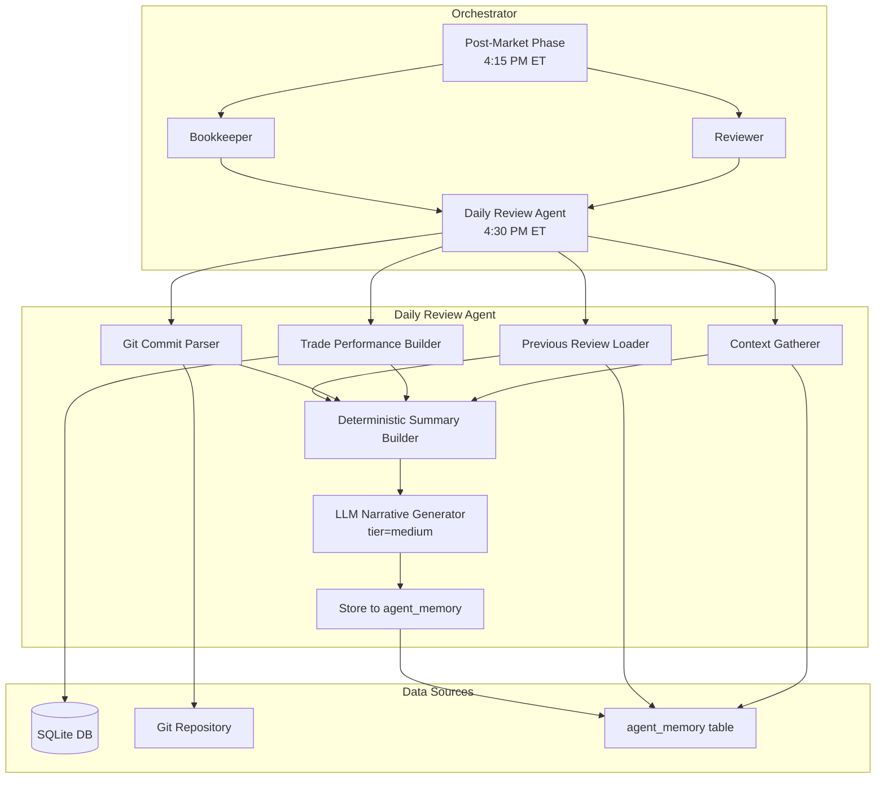

# Design Document: Daily Review Agent

## Overview

The Daily Review Agent is a post-market agent that synthesizes the full trading day into a cohesive narrative journal entry. It runs after the Reviewer and Bookkeeper complete at 4:15 PM ET, gathering trade performance data, git commit history, agent context, and case library entries to produce a structured-then-narrative daily review.

The agent follows a two-phase generation approach:
1. **Deterministic summary** — Pure Python queries against the database and git log, producing a structured JSON summary with no LLM involvement
2. **Narrative generation** — The deterministic summary is passed to the LLM as context, which produces the readable journal narrative

This separation ensures reproducibility of the factual layer and confines LLM creativity to the narrative layer only.

## Architecture



### Data Flow

1. Orchestrator invokes `daily_review.run(engine)` at ~4:30 PM ET (after post-market)
2. The agent gathers inputs in parallel:
   - Trade performance from `trades`, `daily_log`, `positions` tables
   - Git commits via `subprocess.run(["git", "log", ...])` 
   - Agent context from `agent_memory` (researcher, reviewer, analyst)
   - Previous day's review from `agent_memory`
   - Today's case library entries from `cases` table
3. The deterministic summary builder assembles all data into a structured dict
4. The LLM receives the deterministic summary and generates the narrative
5. The final review JSON is stored in `agent_memory`

## Components and Interfaces

### 1. `agents/daily_review.py` — Main Agent Module

```python
def run(engine) -> dict:
    """
    Main entry point. Called by orchestrator after post-market.
    Returns the complete daily review dict.
    """

def gather_trade_performance(engine, today: str) -> dict:
    """
    Query trades, daily_log, and positions for today's performance.
    Returns Trade_Performance_Summary dict.
    """

def gather_git_commits(since_date: str) -> list[dict]:
    """
    Parse git log since the given date.
    Returns list of commit dicts with message, author, timestamp, files, category.
    """

def categorize_commit(message: str, files: list[str]) -> str:
    """
    Deterministic categorization of a commit based on message and changed files.
    Returns one of: agent_logic, risk_management, infrastructure, strategy, bugfix, other.
    """

def gather_agent_context(engine) -> dict:
    """
    Read latest context from agent_memory for researcher, reviewer, analyst.
    Returns dict with available context and missing sources list.
    """

def load_previous_review(engine, today: str) -> dict | None:
    """
    Load the previous trading day's review for continuity.
    Returns the review dict or None.
    """

def build_deterministic_summary(
    trade_perf: dict,
    git_commits: list[dict],
    agent_context: dict,
    cases: list[dict],
    previous_review: dict | None,
) -> dict:
    """
    Assemble all gathered data into a structured summary.
    No LLM calls. Pure data transformation.
    """

def generate_narrative(deterministic_summary: dict, tier: str = "medium") -> dict:
    """
    Pass the deterministic summary to the LLM for narrative generation.
    Returns the complete Daily_Review JSON.
    """
```

### 2. Git Commit Parser

The git commit parser uses `subprocess.run` to execute `git log` with a structured format:

```python
GIT_LOG_FORMAT = "--format=%H|%an|%aI|%s"

def gather_git_commits(since_date: str) -> list[dict]:
    """
    Runs: git log --since="{since_date}" --format="%H|%an|%aI|%s" --name-only
    Parses output into structured commit dicts.
    Falls back gracefully if git is unavailable.
    """
```

Commit categorization is deterministic, based on file paths and keywords:

| Category | File path patterns | Message keywords |
|---|---|---|
| `agent_logic` | `agents/*.py` | agent, signal, decision |
| `risk_management` | `core/*.py`, `utils/trade_validator.py` | risk, stop, edge, position size |
| `infrastructure` | `orchestrator.py`, `deploy/*`, `db/*` | deploy, schedule, migrate, schema |
| `strategy` | `models/strategies.py`, `utils/strategy_store.py` | strategy, setup, backtest |
| `bugfix` | any | fix, bug, patch, hotfix |
| `other` | fallback | — |

### 3. Deterministic Summary Builder

Produces a structured dict from pure database queries and git data — no LLM:

```python
{
    "date": "2026-03-22",
    "trade_performance": {
        "total_trades": 5,
        "wins": 3,
        "losses": 2,
        "total_pnl": 245.50,
        "total_pnl_pct": 0.08,
        "realized_pnl": 245.50,
        "unrealized_pnl": -32.10,
        "net_daily_change": 213.40,
        "per_profile": {
            "conservative": {"trades": 1, "wins": 1, "pnl": 120.00, ...},
            "moderate": {"trades": 2, "wins": 1, "pnl": 85.50, ...},
            "aggressive": {"trades": 2, "wins": 1, "pnl": 40.00, ...},
        },
        "best_trade": {"symbol": "NVDA", "pnl_pct": 2.1, "setup_type": "gap_and_go"},
        "worst_trade": {"symbol": "TSLA", "pnl_pct": -1.3, "setup_type": "momentum_fade"},
        "setup_breakdown": {"gap_and_go": {"count": 2, "wins": 2}, ...},
        "no_trades": false,
    },
    "git_changes": {
        "commits": [...],
        "total_commits": 3,
        "categories": {"agent_logic": 1, "bugfix": 2},
        "no_commits": false,
    },
    "agent_context": {
        "market_context": "...",
        "selection_feedback": "...",
        "execution_feedback": {...},
        "analyst_signals": {...},
        "missing_sources": [],
    },
    "cases_today": [...],
    "previous_review_summary": "...",
    "completeness": {
        "trade_data": true,
        "git_data": true,
        "researcher_context": true,
        "reviewer_feedback": true,
        "analyst_signals": true,
        "previous_review": true,
        "confidence": "high",  # high|medium|low based on available sources
    },
}
```

### 4. LLM Narrative Generator

The narrative generator receives the deterministic summary and produces the final review:

```python
SYSTEM_PROMPT = """You are a trading journal writer for a multi-agent paper trading system.
You receive a structured data summary and produce a narrative daily review for the system's overseer.

Rules:
- Use observational language for correlations, never causal claims
- When sample size < 5, use hedging language ("may", "possibly", "early indication")
- Reference specific trades by symbol and setup type
- Keep lessons actionable with evidence
- Separate process quality from financial outcomes
- Include watchouts as machine-readable flags

Return JSON with these fields:
{
    "market_summary": "...",
    "trade_performance": "...",
    "git_changes": "...",
    "correlations": "...",
    "lessons_learned": [...],
    "process_quality": "...",
    "outlook": "...",
    "watchouts": ["...", "..."],
    "completeness": {...}
}
"""
```

The LLM is called at `tier="medium"` (local LLM) to keep costs zero. The narrative is merged with the deterministic summary fields to produce the final stored review.

### 5. Web App Changes

#### API Endpoint: `/api/journal`

```python
@app.route("/api/journal")
def api_journal():
    """
    Returns Daily_Review entries from agent_memory.
    Supports pagination via ?page=1&per_page=10 query params.
    """
```

#### UI: Journal Tab

A new "Journal" tab is added to the main navigation in `index.html`. Journal entries render as expandable date-labeled cards with sections for each review component.

### 6. Orchestrator Integration

A new job is added to the orchestrator schedule:

```python
# Daily Review: 4:30 PM ET (after Reviewer + Bookkeeper at 4:15)
scheduler.add_job(
    run_daily_review,
    CronTrigger(day_of_week="mon-fri", hour=16, minute=30, timezone="America/New_York"),
    id="daily_review",
)
```

The `run_daily_review` function follows the same error-handling pattern as other post-market jobs — errors are logged but don't affect other agents.

## Data Models

### Daily Review JSON Structure

The complete review stored in `agent_memory`:

```python
{
    # Deterministic fields (from summary builder)
    "date": "2026-03-22",
    "generated_at": "2026-03-22T20:30:00Z",
    "trade_performance": {
        "total_trades": 5,
        "wins": 3,
        "losses": 2,
        "total_pnl": 245.50,
        "total_pnl_pct": 0.08,
        "realized_pnl": 245.50,
        "unrealized_pnl": -32.10,
        "net_daily_change": 213.40,
        "per_profile": {
            "conservative": {"trades": 1, "wins": 1, "pnl": 120.00, "pnl_pct": 0.12},
            "moderate": {"trades": 2, "wins": 1, "pnl": 85.50, "pnl_pct": 0.09},
            "aggressive": {"trades": 2, "wins": 1, "pnl": 40.00, "pnl_pct": 0.04},
        },
        "best_trade": {"symbol": "NVDA", "pnl_pct": 2.1, "setup_type": "gap_and_go"},
        "worst_trade": {"symbol": "TSLA", "pnl_pct": -1.3, "setup_type": "momentum_fade"},
        "setup_breakdown": {},
        "no_trades": false,
    },
    "git_changes": {
        "commits": [
            {
                "hash": "abc123",
                "author": "blaine",
                "timestamp": "2026-03-22T14:30:00-04:00",
                "message": "Fix analyst RSI threshold",
                "files": ["agents/analyst.py"],
                "category": "agent_logic",
            }
        ],
        "total_commits": 1,
        "categories": {"agent_logic": 1},
        "no_commits": false,
    },

    # Narrative fields (from LLM)
    "market_summary": "Markets traded in a risk-on environment today...",
    "trade_narrative": "The system took 5 trades across all profiles...",
    "git_narrative": "One commit was deployed today affecting the Analyst...",
    "correlations": "The Analyst RSI threshold change coincided with...",
    "lessons_learned": [
        {
            "category": "signal_quality",
            "lesson": "Gap-and-go setups above daily resistance continued to outperform",
            "evidence": "NVDA +2.1% (gap_and_go, above_daily_resistance=true)",
            "action": "Continue favoring gap_and_go when above daily resistance in risk_on regime",
        }
    ],
    "process_quality": "Execution discipline was strong today...",
    "outlook": "Watch for continuation in NVDA...",
    "watchouts": [
        "TSLA momentum_fade setup failed — review entry timing",
        "Aggressive profile approaching daily loss limit",
    ],
    "completeness": {
        "trade_data": true,
        "git_data": true,
        "researcher_context": true,
        "reviewer_feedback": true,
        "analyst_signals": true,
        "previous_review": true,
        "confidence": "high",
    },
}
```

### Storage in agent_memory

| Field | Value |
|---|---|
| `agent` | `"daily_review"` |
| `symbol` | `"2026-03-22"` (the date, for querying) |
| `key` | `"daily_review"` |
| `value` | JSON string of the complete review |

This follows the same pattern as `meta_reviewer` storing weekly reviews. The `symbol` field is repurposed to hold the date for efficient querying.

### Lesson Structure

Each lesson in `lessons_learned` follows this schema:

```python
{
    "category": str,    # signal_quality | execution | risk_management | strategy | system
    "lesson": str,      # One actionable sentence
    "evidence": str,    # Specific trade/case reference
    "action": str,      # Suggested follow-up
}
```

## Correctness Properties

*A property is a characteristic or behavior that should hold true across all valid executions of a system — essentially, a formal statement about what the system should do. Properties serve as the bridge between human-readable specifications and machine-verifiable correctness guarantees.*

### Property 1: Trade performance aggregation correctness

*For any* list of closed trades with varying profiles, P&L values, and setup types, `gather_trade_performance` SHALL produce a summary where: total_trades equals the length of the input list, wins equals the count of trades with positive P&L, losses equals the count of trades with non-positive P&L, total_pnl equals the sum of all trade P&L values, per_profile breakdowns sum to the totals, and setup_breakdown counts match the actual grouping of trades by setup_type.

**Validates: Requirements 2.3, 2.5**

### Property 2: Best and worst trade identification

*For any* non-empty list of closed trades with distinct P&L percentages, the best_trade in the Trade_Performance_Summary SHALL have a pnl_pct equal to the maximum pnl_pct in the input, and the worst_trade SHALL have a pnl_pct equal to the minimum pnl_pct in the input.

**Validates: Requirements 2.4**

### Property 3: Realized vs unrealized P&L separation

*For any* combination of closed trades and open positions, the Trade_Performance_Summary SHALL report realized_pnl equal to the sum of closed trade P&L, unrealized_pnl equal to the sum of open position unrealized P&L, and net_daily_change equal to realized_pnl plus unrealized_pnl.

**Validates: Requirements 2.7**

### Property 4: Git log parsing round-trip

*For any* valid set of commit data (hash, author, ISO timestamp, message, file list), formatting it as the expected git log output and then parsing it with the git commit parser SHALL produce commit dicts with fields matching the original data.

**Validates: Requirements 3.2**

### Property 5: Commit categorization valid output

*For any* commit message string and list of file paths, `categorize_commit` SHALL return exactly one of: `agent_logic`, `risk_management`, `infrastructure`, `strategy`, `bugfix`, or `other`.

**Validates: Requirements 3.3**

### Property 6: Deterministic summary makes no LLM calls

*For any* valid combination of trade performance data, git commits, agent context, cases, and previous review, `build_deterministic_summary` SHALL produce a complete structured summary without invoking `call_llm`.

**Validates: Requirements 6.5**

### Property 7: Output structure completeness

*For any* valid deterministic summary passed through narrative generation, the resulting Daily_Review JSON SHALL contain all required top-level fields: `market_summary`, `trade_performance`, `git_changes`, `correlations`, `lessons_learned`, `process_quality`, `outlook`, `watchouts`, and `completeness`.

**Validates: Requirements 6.1, 6.3**

### Property 8: Completeness tracking accuracy

*For any* subset of available agent context sources (researcher, reviewer, analyst, previous review), the completeness section SHALL accurately report each source's availability as a boolean, list all unavailable sources in missing_sources, and compute confidence as "high" when all sources are present, "medium" when some are missing, and "low" when most are missing.

**Validates: Requirements 7.4, 7.5**

### Property 9: No-overwrite on duplicate date

*For any* date that already has a stored Daily_Review in agent_memory, running the Daily_Review_Agent for the same date SHALL NOT modify or delete the existing review entry.

**Validates: Requirements 8.2**

### Property 10: Journal API sort order

*For any* set of Daily_Review entries stored in agent_memory with varying dates, the `/api/journal` endpoint SHALL return entries sorted by date in strictly descending order.

**Validates: Requirements 10.2**

### Property 11: Journal API pagination

*For any* positive integer values of page and per_page, and any set of stored journal entries, the `/api/journal` endpoint SHALL return at most per_page entries, and the entries SHALL correspond to the correct offset slice of the full sorted result set.

**Validates: Requirements 10.3**

## Error Handling

| Component | Failure Mode | Behavior | Rationale |
|---|---|---|---|
| `run()` (top-level) | Any unhandled exception | Orchestrator catches, logs error, continues | Fail-open: review failure must not block other agents |
| `gather_trade_performance()` | DB query fails | Return empty summary with `no_trades=true` | Fail-open: missing trade data noted in completeness |
| `gather_git_commits()` | `git` command not found or fails | Log warning, return `{"commits": [], "no_commits": true}` | Fail-open: git data is supplementary |
| `gather_git_commits()` | Not a git repository | Log warning, return empty | Same as above |
| `gather_agent_context()` | Missing agent_memory entries | Proceed without, add to `missing_sources` | Fail-open: partial context is better than no review |
| `load_previous_review()` | No previous review exists | Return `None`, note in completeness | Expected on first run |
| `build_deterministic_summary()` | Any component data is None | Use empty defaults, flag in completeness | Deterministic phase must never fail |
| `generate_narrative()` | LLM call fails | Log error, return review with deterministic data only (no narrative sections) | Fail-graceful: deterministic summary is still valuable |
| `generate_narrative()` | LLM returns invalid JSON | Use `parse_json_response` with fallback, log warning | Existing pattern from `utils/llm.py` |
| Storage | Duplicate date check fails | Skip storage, log warning | Protect existing reviews |
| `/api/journal` | DB query fails | Return empty list with 200 status | Consistent with other API endpoints |
| `/api/journal` | Invalid pagination params | Default to page=1, per_page=10 | Graceful fallback |

### Error Handling Design Principles

1. **Fail-open for data gathering**: Missing inputs reduce review quality but don't prevent generation
2. **Fail-graceful for LLM**: If the LLM fails, the deterministic summary is still stored and displayed
3. **Fail-closed for storage**: Never overwrite an existing review
4. **Consistent with existing agents**: Follow the same try/except + log pattern used by reviewer, bookkeeper, and meta_reviewer

## Testing Strategy

### Property-Based Tests (Hypothesis)

The project already uses Hypothesis for property-based testing (see `tests/test_edge_score.py`). The daily review agent tests will follow the same patterns.

**Library**: `hypothesis` (already in use)
**Minimum iterations**: 100 per property test
**Tag format**: `Feature: daily-review-agent, Property {N}: {title}`

Properties 1–8 are testable as property-based tests against the pure Python functions (`gather_trade_performance`, `categorize_commit`, `build_deterministic_summary`, completeness computation). Properties 9–11 require database fixtures but can still use Hypothesis to generate the test data.

### Unit Tests

- Orchestrator scheduling: verify cron trigger configuration (Req 1.1–1.3)
- Error isolation: mock `daily_review.run` to raise, verify orchestrator continues (Req 1.4)
- Agent context gathering: insert known agent_memory rows, verify correct retrieval (Req 7.1–7.3)
- Storage format: verify agent_memory row has correct agent/key/symbol fields (Req 6.4, 8.1)
- Previous review loading: verify correct date lookup (Req 8.3)
- LLM prompt construction: verify system prompt contains observational language and hedging instructions (Req 4.3, 4.4)
- Lesson structure validation: verify evidence and action fields are required (Req 5.5)
- Process quality separation: verify output has separate process_quality and trade_performance fields (Req 9.1, 9.2)
- Journal API: test endpoint returns correct JSON structure (Req 10.1, 10.4)
- Journal UI: verify HTML contains Journal tab (Req 10.5)
- Empty states: no trades, no commits, no journal entries (Req 2.6, 3.4, 3.5, 10.10)

### Integration Tests

- Full agent run with seeded database: verify end-to-end flow from `run(engine)` to stored review
- LLM tier verification: mock `call_llm`, verify called with `tier="medium"` (Req 6.2)
- Web API with seeded data: verify `/api/journal` returns correctly formatted responses

