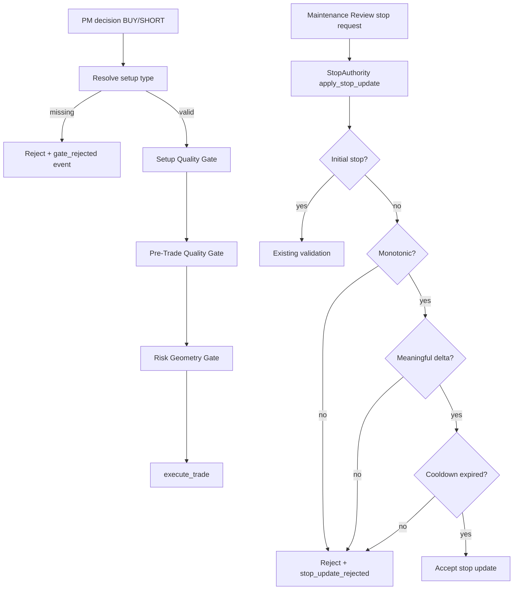

# Design Document: Risk Discipline Patch

## Overview

This patch adds deterministic risk discipline around two failure modes observed on 2026-05-07:

1. **Missing setup types fail closed.** A trade without a resolved setup type is rejected before entry gates continue. Empty setup can no longer be interpreted as an unseen setup with no case history.
2. **Maintenance stop updates become stateful and anti-thrash.** Routine stop maintenance must be monotonic, meaningfully different, and rate-limited per trade.

The design keeps the implementation narrow. It does not attempt to solve bad indicator data, repeated setup proposals, or catalyst reconfirmation.

## Architecture



## Components and Interfaces

### 1. Setup Resolution Helper

Add a helper in `agents/portfolio_manager.py`:

```python
def _resolve_setup_type(decision: dict, signal: dict | None) -> str | None:
    raw = (
        decision.get("setup_type")
        or decision.get("setup")
        or (signal or {}).get("setup_type")
        or (signal or {}).get("setup")
    )
    if raw is None:
        return None
    setup = str(raw).strip()
    return setup or None
```

Use it anywhere setup type is currently rebuilt ad hoc:

- `_run_gate_pipeline()`
- entry timing gate
- LessonRegistry check input
- confidence adjustment
- strategy multiplier lookup
- entry contract setup source where practical

For this patch, the must-fix path is `_run_gate_pipeline()` before `evaluate_setup_quality()`.

### 2. Missing Setup Gate Behavior

Inside `_run_gate_pipeline()`:

1. Resolve setup type with `_resolve_setup_type()`.
2. If missing:
   - append a gate note: `{"gate": "setup_quality_gate", "decision": "reject", "reason_type": "missing_setup_type", "reason": "missing setup_type after decision/signal fallback"}`
   - log a `gate_rejected` or `gate_error`-style event if available at that layer; otherwise rely on the existing caller to convert `notes` to `gate_rejected`.
   - return `False` before calling `evaluate_setup_quality()`.

This is intentionally fail-closed. A valid trade must have a named setup.

### 3. StopAuthority Anti-Thrash Rules

Preferred location: `utils/stop_authority.py`, inside or immediately before `apply_stop_update()`, because multiple agents call this function.

Add constants:

```python
MAINTENANCE_STOP_COOLDOWN_MINUTES = 15
MIN_STOP_CHANGE_PCT_OF_PRICE = 0.0025
MIN_STOP_CHANGE_ATR_MULTIPLE = 0.25
MIN_STOP_CHANGE_PCT_OF_STOP_FALLBACK = 0.001
```

Add helper concepts:

- `_is_maintenance_update(source_agent, stop_role, reason) -> bool`
- `_is_monotonic_tighten(trade, new_stop) -> bool`
- `_minimum_stop_delta(current_price, current_stop, atr_5min=None) -> float`
- `_latest_accepted_stop_update_at(db, trade_id) -> datetime | None`

#### Monotonic Rule

Use trade direction:

- `LONG`: `new_stop > current_stop` required for routine maintenance.
- `SHORT`: `new_stop < current_stop` required for routine maintenance.

This makes “tighten” actually mean tighten. If future behavior needs stop loosening, add an explicit exceptional flow rather than hiding it inside maintenance.

#### Minimum Delta Rule

Compute:

```python
thresholds = []
if current_price:
    thresholds.append(abs(current_price) * 0.0025)
if atr_5min:
    thresholds.append(abs(atr_5min) * 0.25)
if not thresholds and current_stop:
    thresholds.append(abs(current_stop) * 0.001)
minimum_delta = max(thresholds)
```

Reject/skip if `abs(new_stop - current_stop) < minimum_delta`.

ATR can be omitted in the initial implementation; the current-price threshold is enough to stop most churn. Add an implementation note if ATR is deferred.

#### Cooldown Rule

Query `trade_events` for latest accepted stop update:

- `trade_id == trade.id`
- `event_type == "stop_update_accepted"`
- source/agent role maintenance if payload supports it; if not, latest accepted stop update for trade is acceptable initially.

Reject if `now - latest < 15 minutes`.

### 4. Event Logging

Use existing `log_trade_event()` behavior through StopAuthority where possible.

Rejected/skipped stop updates should include payload fields:

```json
{
  "reason_type": "non_monotonic|tiny_delta|cooldown",
  "current_stop": 206.5,
  "requested_stop": 206.75,
  "current_price": 210.0,
  "minimum_delta": 0.525,
  "cooldown_minutes": 15
}
```

This makes future decision-log audits straightforward.

## Data Model

No schema migration should be required. Cooldown can use existing `trade_events.timestamp` and `event_type`.

If querying by `dedupe_key` or payload becomes too slow later, add an index in a separate migration. Not needed for this patch.

## Testing Strategy

### Unit Tests

Add or extend tests in:

- `tests/test_pm_missing_setup_gate.py`
- `tests/test_stop_authority_anti_thrash.py`

Coverage:

1. Missing setup in decision and signal rejects before setup quality allows.
2. Whitespace-only setup rejects.
3. Valid setup from analyst fallback proceeds to setup quality gate.
4. Long maintenance stop lower than current stop rejects.
5. Short maintenance stop higher than current stop rejects.
6. Equal stop rejects/skips as no-op.
7. Tiny stop change rejects/skips.
8. Cooldown rejects second accepted update inside 15 minutes.
9. Initial stop set remains unaffected.
10. Stop-triggered close path remains unaffected.

### Smoke Verification

After implementation:

```bash
python -m py_compile agents/portfolio_manager.py utils/stop_authority.py
python -m pytest tests/test_pm_missing_setup_gate.py tests/test_stop_authority_anti_thrash.py -q
```

On Pi deploy:

```bash
cd /home/blaine/paper-trader
venv/bin/python -m py_compile agents/portfolio_manager.py utils/stop_authority.py
sudo systemctl restart paper-trader
systemctl --no-pager --lines=20 status paper-trader
```

## Rollout Plan

1. Implement missing setup fail-closed first.
2. Implement StopAuthority monotonic rule.
3. Add minimum delta threshold.
4. Add cooldown.
5. Run focused tests and existing stop-authority integration tests.
6. Deploy after market or while market is closed when possible.
7. Next trading day, audit:
   - count `gate_rejected` with missing setup
   - count `stop_update_accepted` per trade
   - count `stop_update_rejected` by reason

## Non-Goals

- No indicator/data sanity validation in this patch.
- No catalyst reconfirmation behavior in this patch.
- No setup proposal cooldown in this patch.
- No setup taxonomy rename/migration in this patch.
- No dashboard redesign in this patch.
