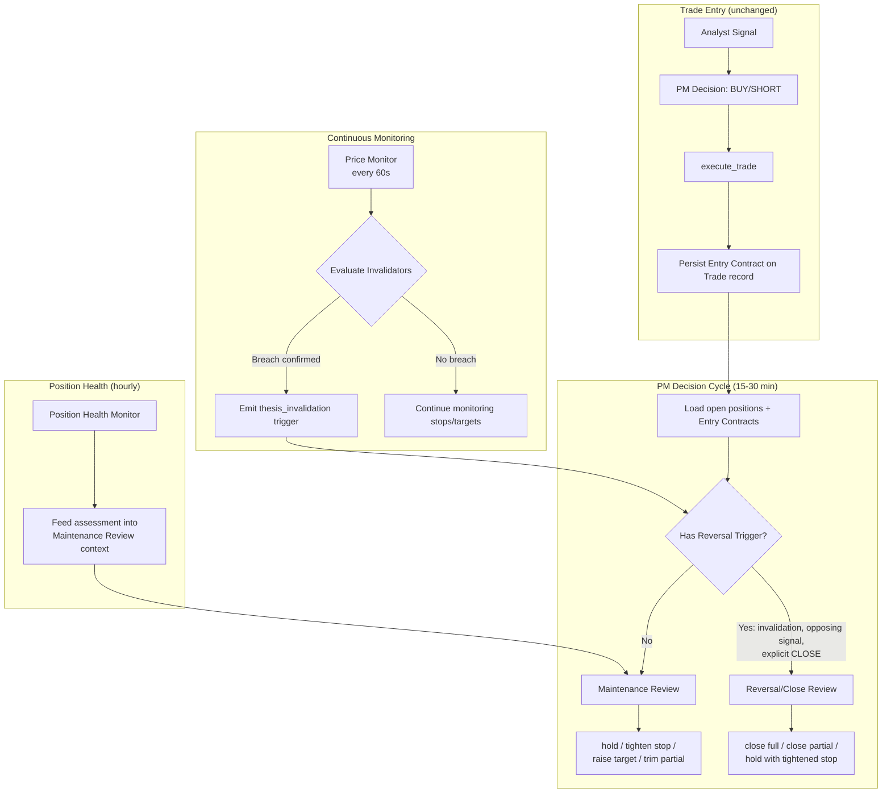

# Design Document: Thesis-Anchored Exits

## Overview

This feature replaces the Portfolio Manager's implicit "no signal = exit" behavior with a thesis-anchored decision framework. Every trade records an **Entry Contract** at open — capturing the thesis, setup type, stop, target, and structured invalidation conditions. All subsequent hold/exit decisions reference this contract rather than relying on fresh analyst signals.

The system introduces:
1. **Entry Contract persistence** — new columns on the `Trade` model storing thesis, setup type, and structured invalidators as JSON.
2. **Thesis Invalidation Engine** — a deterministic evaluator in `price_monitor.py` that checks structured invalidator conditions against live market data every 60 seconds.
3. **DRIFTING state** — a computed label for positions without recent analyst signals, which explicitly does NOT trigger exits.
4. **Two-tier review system** — Maintenance Review (default, cannot close) and Reversal/Close Review (event-triggered only, can close). This replaces the current flat LLM decision loop for open positions.
5. **Legacy migration** — best-effort Entry Contract construction for trades opened before this feature.

The design preserves all existing entry logic (edge score, similarity, portfolio risk, trade validation) and only modifies the hold/exit decision path.

## Architecture



### Key Design Decisions

1. **Entry Contract on Trade table, not AgentMemory.** AgentMemory rotates and is volatile. The Entry Contract must survive agent restarts and memory cleanup for the lifetime of the trade. Storing it as columns on the `Trade` model guarantees persistence and queryability.

2. **Structured invalidators as JSON column.** Invalidators need to be machine-evaluable by the Price Monitor without LLM calls. A JSON array of typed objects (`price_below_level`, `price_above_level`, `structure_break`) enables deterministic evaluation. The `Text` column type with JSON serialization matches the existing pattern used by `DynamicStrategy.ideal_conditions`.

3. **DRIFTING is a computed state, not a DB column.** Whether a position is drifting depends on comparing the trade's `entry_time` against the latest analyst signal timestamp. This is cheap to compute at query time and avoids stale state if signals arrive between cycles.

4. **Two-tier review via separate LLM prompts.** The current PM uses a single prompt that can produce any action. The new design uses two distinct prompt templates: one for Maintenance (constrained to hold/tighten/raise/trim) and one for Reversal/Close (can produce close). This structural constraint prevents the LLM from closing positions during routine maintenance.

5. **Invalidation engine in Price Monitor, not PM.** The Price Monitor already runs every 60 seconds and has access to live prices. Adding invalidator evaluation here gives sub-minute detection without adding LLM cost. The PM only handles the higher-level review decision.

## Components and Interfaces

### 1. Trade Model Extensions (`db/schema.py`)

New columns on the `Trade` class:

| Column | Type | Description |
|--------|------|-------------|
| `thesis` | `Text` | The trade thesis narrative from `reason_entry` + analyst context |
| `setup_type` | `String(64)` | The analyst's setup classification (e.g., `gap_and_go`, `vwap_reclaim`) |
| `invalidators` | `Text` | JSON array of structured invalidator objects |

The `invalidators` column stores a JSON array like:
```json
[
  {"type": "price_below_level", "reference": "VWAP", "confirmation": "5m_close", "lookback_bars": 1},
  {"type": "price_below_level", "reference": "162.50", "confirmation": "tick", "lookback_bars": 0}
]
```

### 2. Entry Contract Builder (`agents/portfolio_manager.py`)

New function `build_entry_contract(decision, signal, stop, target) -> dict`:
- Extracts thesis from `decision["rationale"]` + signal context
- Extracts setup_type from signal or decision
- Parses invalidators from `signal["invalidation"]` into structured JSON objects
- Falls back to stop-price-based default invalidator if signal lacks invalidation field
- Returns `{"thesis": str, "setup_type": str, "invalidators": list[dict]}`

Called inside `execute_trade()` for BUY/SHORT actions. The returned fields are set on the `Trade` record before commit.

### 3. Invalidator Schema

Each invalidator is a dict with these fields:

| Field | Type | Required | Description |
|-------|------|----------|-------------|
| `type` | `str` | Yes | One of: `price_below_level`, `price_above_level`, `structure_break` |
| `reference` | `str` | Yes | The anchor — a price level (e.g., `"162.50"`) or indicator name (e.g., `"VWAP"`) |
| `confirmation` | `str` | Yes | How the breach is confirmed: `"tick"` (immediate), `"5m_close"` (candle close) |
| `lookback_bars` | `int` | Yes | Number of bars for confirmation (0 = immediate, 1 = one bar close) |

Supported `type` values:
- `price_below_level` — for LONG trades, price drops below reference
- `price_above_level` — for SHORT trades, price rises above reference
- `structure_break` — a named technical structure is broken (evaluated by LLM during Reversal Review, not by Price Monitor)

### 4. Invalidation Evaluation Engine (`agents/price_monitor.py`)

New function `evaluate_invalidators(trade, current_price, candle_data=None) -> list[dict]`:
- Iterates over `trade.invalidators` (parsed from JSON)
- For each invalidator:
  - Resolves `reference` to a numeric value (literal price or live indicator like VWAP)
  - Checks breach based on `type` (below/above)
  - Applies `confirmation` logic:
    - `"tick"`: breach on current price is sufficient
    - `"5m_close"`: breach must be confirmed by a 5-minute candle close (uses `lookback_bars`)
  - Skips `structure_break` type (handled by LLM in Reversal Review)
- Returns list of breached invalidator objects

Integrated into `check_stops_and_targets()` — after existing stop/target checks, also evaluates invalidators. Breached invalidators are emitted as `thesis_invalidation` triggers alongside existing `stop_loss` and `target_hit` triggers.

### 5. DRIFTING State Detection (`agents/portfolio_manager.py`)

New function `detect_drifting(db, trade) -> bool`:
- Queries `AgentMemory` for the latest analyst signal for `trade.symbol`
- Compares signal timestamp against `trade.entry_time`
- Returns `True` if no signal exists after entry time

Used in:
- `get_portfolio_for_profile()` — adds `"drifting": True/False` to each position dict
- `run_profile()` — determines review mode routing

### 6. Two-Tier Review System (`agents/portfolio_manager.py`)

#### Maintenance Review

New prompt template `MAINTENANCE_REVIEW_PROMPT`:
- Receives: Entry Contract, current price, indicators, advisory signals, position health
- Constrained output: `{"action": "hold|tighten_stop|raise_target|trim_partial", ...}`
- Cannot produce `CLOSE`
- Runs every PM cycle (15-30 min) for all open positions without a Reversal trigger

#### Reversal/Close Review

New prompt template `REVERSAL_CLOSE_PROMPT`:
- Receives: Entry Contract, breach details, current market conditions, opposing evidence
- Output: `{"action": "close_full|close_partial|hold_tighten", ...}`
- Only invoked when a trigger fires:
  - `thesis_invalidation` from Price Monitor
  - Opposing analyst signal (e.g., LONG position gets SHORT signal with strength ≥ configurable threshold)
  - Explicit CLOSE signal

#### Decision Loop Changes in `run_profile()`

The current flow sends all positions + signals to a single LLM call. The new flow:

1. Load all open positions with their Entry Contracts
2. Check for pending Reversal triggers (from Price Monitor invalidations stored in AgentMemory, or opposing signals)
3. For positions WITH a Reversal trigger → call Reversal/Close Review
4. For positions WITHOUT a Reversal trigger → call Maintenance Review
5. For NEW entries (no existing position) → use existing entry logic unchanged
6. Execute resulting decisions via `execute_trade()`

### 7. Position Health Integration (`agents/position_health.py`)

Changes:
- Include Entry Contract data (thesis, invalidators, setup_type) in the position data sent to the health LLM
- Include DRIFTING state label
- Health assessments are already stored in AgentMemory and read by PM — no change to that flow
- The health assessment feeds into Maintenance Review context (already happens via `health_text` in PM prompt)

### 8. Legacy Trade Migration (`agents/portfolio_manager.py`)

New function `build_legacy_entry_contract(trade) -> dict | None`:
- If `trade.thesis` is already populated → return None (no migration needed)
- If `trade.stop_price` and `trade.target_price` exist → construct Entry Contract:
  - `thesis` = `trade.reason_entry` or `"Legacy trade — no thesis recorded"`
  - `setup_type` = `"unknown"`
  - `invalidators` = default invalidator from stop price
- If only `stop_price` exists → partial contract with stop-based invalidator
- If neither exists → return None (fall back to signal-based evaluation)
- Logs a warning for each legacy trade migrated

Called in `run_profile()` when loading open positions — if Entry Contract fields are empty, attempt migration.

### 9. Opposing Evidence Threshold (`models/pm_profiles.py`)

New field per profile:

| Profile | `opposing_evidence_threshold` | Description |
|---------|-------------------------------|-------------|
| conservative | `"moderate"` | Moderate opposing signal triggers Reversal Review |
| moderate | `"strong"` | Only strong opposing signals trigger Reversal Review |
| aggressive | `"strong"` | Only strong opposing signals trigger Reversal Review |

This maps to the analyst signal `strength` field. When a new signal contradicts the Entry Contract direction and its strength meets or exceeds the threshold, a Reversal/Close Review is triggered.

## Data Models

### Trade Model (updated)

```python
class Trade(Base):
    __tablename__ = "trades"
    
    # ... existing columns unchanged ...
    
    # New Entry Contract columns
    thesis = Column(Text, nullable=True)           # Trade thesis narrative
    setup_type = Column(String(64), nullable=True)  # e.g., "gap_and_go", "vwap_reclaim"
    invalidators = Column(Text, nullable=True)      # JSON array of invalidator objects
```

### Invalidator Object Schema

```python
# Type definition (not a DB model — stored as JSON in Trade.invalidators)
InvalidatorSchema = {
    "type": str,           # "price_below_level" | "price_above_level" | "structure_break"
    "reference": str,      # Price level or indicator name
    "confirmation": str,   # "tick" | "5m_close"
    "lookback_bars": int,  # 0 for immediate, 1+ for candle confirmation
}
```

### PM Profile Extension

```python
# Added to each profile in PM_PROFILES
"opposing_evidence_threshold": "moderate",  # or "strong"
```

### Maintenance Review Output Schema

```json
{
  "reviews": [
    {
      "symbol": "AMD",
      "action": "hold",
      "new_stop": null,
      "new_target": null,
      "trim_pct": null,
      "reasoning": "Thesis intact, price above VWAP, holding to target"
    }
  ],
  "notes": "All positions healthy, no adjustments needed"
}
```

### Reversal/Close Review Output Schema

```json
{
  "symbol": "AMD",
  "action": "close_full",
  "reasoning": "VWAP lost on 5m close, thesis invalidated",
  "trigger": "thesis_invalidation",
  "invalidator": {"type": "price_below_level", "reference": "VWAP", "confirmation": "5m_close", "lookback_bars": 1}
}
```

### Thesis Invalidation Trigger (Price Monitor → AgentMemory)

```json
{
  "type": "thesis_invalidation",
  "symbol": "AMD",
  "profile": "moderate",
  "trade_id": 42,
  "price": 161.80,
  "invalidator": {"type": "price_below_level", "reference": "VWAP", "confirmation": "5m_close", "lookback_bars": 1},
  "timestamp": "2025-01-15T14:30:00Z"
}
```


## Correctness Properties

*A property is a characteristic or behavior that should hold true across all valid executions of a system — essentially, a formal statement about what the system should do. Properties serve as the bridge between human-readable specifications and machine-verifiable correctness guarantees.*

### Property 1: Entry Contract completeness and invalidator structure

*For any* valid BUY/SHORT decision dict and any analyst signal dict (with or without an invalidation field), calling `build_entry_contract(decision, signal, stop, target)` SHALL produce an Entry Contract where: `thesis` is a non-empty string, `setup_type` is a non-empty string, and `invalidators` is a non-empty list where every element contains all four required fields (`type`, `reference`, `confirmation`, `lookback_bars`) with valid values (`type` in `{"price_below_level", "price_above_level", "structure_break"}`, `confirmation` in `{"tick", "5m_close"}`, `lookback_bars` >= 0).

**Validates: Requirements 1.1, 1.3**

### Property 2: Default invalidator fallback from stop price

*For any* analyst signal that lacks an `invalidation` field and any valid stop price (positive float), `build_entry_contract` SHALL produce an invalidators list containing at least one invalidator whose `reference` field equals the string representation of the stop price.

**Validates: Requirements 1.4**

### Property 3: Close-conditions invariant

*For any* open position with a valid Entry Contract and any combination of market conditions (current price, analyst signals present or absent, DRIFTING or not), the review system SHALL produce a CLOSE decision (close_full or close_partial) only when at least one of these conditions holds: (a) stop price is hit, (b) target price is hit, (c) an explicit CLOSE signal was received, or (d) a Thesis_Invalidator condition is met. Conversely, if none of these conditions hold, no CLOSE decision SHALL be produced.

**Validates: Requirements 2.1, 2.2, 2.3, 3.3, 7.4**

### Property 4: DRIFTING state detection round-trip

*For any* trade with an `entry_time` and any set of analyst signal timestamps for that symbol, `detect_drifting(trade)` SHALL return `True` if and only if no signal timestamp is strictly after `trade.entry_time`. Adding a signal with a timestamp after `entry_time` SHALL cause `detect_drifting` to return `False`.

**Validates: Requirements 3.1, 3.4**

### Property 5: Invalidator evaluation engine

*For any* list of invalidator objects and any current price, `evaluate_invalidators(trade, current_price)` SHALL return a breach for every `price_below_level` invalidator whose numeric reference is above the current price, and for every `price_above_level` invalidator whose numeric reference is below the current price (for `tick` confirmation). It SHALL return no breach for invalidators whose conditions are not met. If multiple invalidators are defined and at least one is breached, the result SHALL be non-empty (OR logic).

**Validates: Requirements 5.2, 5.3, 5.4**

### Property 6: Maintenance Review output constraint

*For any* input to the Maintenance Review (any Entry Contract, any current price, any indicators, any advisory signals), the output `action` field SHALL be one of `{"hold", "tighten_stop", "raise_target", "trim_partial"}`. The output SHALL never contain `"close"`, `"close_full"`, `"close_partial"`, or `"CLOSE"`.

**Validates: Requirements 6.2, 6.3**

### Property 7: Reversal Review trigger routing

*For any* open position, the system SHALL invoke Reversal/Close Review if and only if at least one of these triggers is present: (a) a Thesis_Invalidator breach has been detected, (b) an opposing analyst signal exists with strength meeting or exceeding the profile's `opposing_evidence_threshold`, or (c) an explicit CLOSE/REVERSE condition is received. *For any* signal strength and profile threshold, the opposing-evidence comparison SHALL correctly determine trigger eligibility.

**Validates: Requirements 4.2, 7.1, 7.5**

### Property 8: Reversal/Close Review output constraint

*For any* input to the Reversal/Close Review (any Entry Contract, any breach details, any market conditions), the output `action` field SHALL be one of `{"close_full", "close_partial", "hold_tighten"}`.

**Validates: Requirements 7.2**

### Property 9: Legacy trade migration

*For any* Trade record where `thesis` is NULL: if `stop_price` and `target_price` are both present, `build_legacy_entry_contract` SHALL return a valid Entry Contract with `thesis` derived from `reason_entry`, and `invalidators` containing at least one invalidator referencing the stop price. If only `stop_price` is present (no `target_price`), it SHALL still return a partial contract with a stop-based invalidator. If neither `stop_price` nor `target_price` is present, it SHALL return `None`.

**Validates: Requirements 8.3, 8.4, 8.5**

## Error Handling

### Entry Contract Construction Failures

- If `build_entry_contract` fails to parse the analyst signal's invalidation field, it falls back to the stop-price default invalidator and logs a warning. The trade still executes — Entry Contract construction is fail-open for the thesis/setup_type fields and fail-safe for invalidators (always produces at least one).
- If the signal is entirely missing (e.g., PM acts on a price monitor trigger without analyst context), the Entry Contract uses the decision rationale as thesis, `"unknown"` as setup_type, and the stop-price default invalidator.

### Invalidator Evaluation Failures

- If `evaluate_invalidators` encounters a non-numeric `reference` that cannot be resolved (e.g., `"VWAP"` but VWAP data is unavailable), it skips that invalidator and logs a warning. Other invalidators in the list are still evaluated.
- If the `invalidators` JSON column is malformed or unparseable, the Price Monitor falls back to existing stop/target checks only and logs an error. The position is not left unmonitored.
- If `confirmation` is `"5m_close"` but candle data is unavailable, the invalidator is skipped for that cycle (not treated as breached).

### Legacy Migration Failures

- If `build_legacy_entry_contract` encounters unexpected data (e.g., negative stop price), it returns `None` and the position falls back to signal-based evaluation. A warning is logged.
- Legacy migration is attempted once per PM cycle for trades missing Entry Contracts. If it succeeds, the contract is persisted to the Trade record so migration doesn't repeat.

### LLM Review Failures

- If the Maintenance Review LLM call fails, the position defaults to `hold` (no action taken). This matches the existing pattern where LLM failures don't trigger exits.
- If the Reversal/Close Review LLM call fails, the position defaults to `hold_tighten` (tighten stop to breakeven if profitable, otherwise hold). This is conservative — it doesn't close but does protect capital.
- Both review paths use `try/except` + `log.error` consistent with the existing agent pattern.

### Database Migration

- New columns (`thesis`, `setup_type`, `invalidators`) are added as `nullable=True` to avoid breaking existing data. SQLAlchemy's `create_all` will add them on next startup.
- No data migration script is needed — the legacy migration logic in `run_profile()` handles backfill at runtime.

## Testing Strategy

### Property-Based Tests (Hypothesis)

The project already uses Hypothesis (`.hypothesis/` directory exists). Each correctness property maps to a property-based test with minimum 100 iterations.

**Test file:** `tests/test_thesis_anchored_exits.py`

| Test | Property | What it generates | What it verifies |
|------|----------|-------------------|------------------|
| `test_entry_contract_completeness` | Property 1 | Random decisions, signals, stops, targets | All Entry Contract fields present and valid |
| `test_default_invalidator_fallback` | Property 2 | Random signals without invalidation, random stop prices | Invalidator references stop price |
| `test_close_conditions_invariant` | Property 3 | Random positions, prices, signal states | CLOSE only on valid conditions |
| `test_drifting_detection` | Property 4 | Random entry times, signal timestamps | Correct True/False based on timestamp comparison |
| `test_invalidator_evaluation` | Property 5 | Random invalidator lists, random prices | Correct breach detection with OR logic |
| `test_maintenance_review_output` | Property 6 | Random review inputs | Action always in allowed set |
| `test_reversal_trigger_routing` | Property 7 | Random positions, signals, thresholds | Reversal Review invoked iff trigger present |
| `test_reversal_review_output` | Property 8 | Random review inputs | Action always in allowed set |
| `test_legacy_migration` | Property 9 | Random legacy trades with varying field presence | Correct contract or None based on available fields |

**Configuration:**
- Library: Hypothesis (already in use)
- Minimum iterations: 100 per property (`@settings(max_examples=100)`)
- Tag format: `# Feature: thesis-anchored-exits, Property N: <description>`

### Unit Tests (Example-Based)

| Test | What it covers |
|------|---------------|
| `test_trade_model_has_entry_contract_columns` | Smoke test: Trade has thesis, setup_type, invalidators columns (Req 1.2, 8.1) |
| `test_drifting_label_in_portfolio_snapshot` | DRIFTING label appears in portfolio data (Req 3.5) |
| `test_confirming_signal_routes_to_maintenance` | Confirming signal goes to Maintenance Review (Req 4.3) |
| `test_advisory_vs_authoritative_logging` | Log output classifies signal usage (Req 4.4) |
| `test_reversal_trigger_logged` | Reversal Review trigger is logged (Req 7.3) |
| `test_legacy_migration_logs_warning` | Legacy migration logs warning with trade ID (Req 8.6) |
| `test_health_assessment_in_maintenance_context` | Health data included in Maintenance Review prompt (Req 6.4, 6.5) |

### Integration Tests

| Test | What it covers |
|------|---------------|
| `test_drifting_position_still_monitored` | Price Monitor checks stops/targets for drifting positions (Req 3.2) |
| `test_entry_contract_persists_across_cycles` | Entry Contract survives DB round-trip and is loaded by PM (Req 8.2) |
| `test_full_invalidation_flow` | End-to-end: entry → invalidator breach → Reversal Review → close (Req 5.1, 5.2, 7.1) |
| `test_pm_profile_threshold_integration` | Profile opposing_evidence_threshold correctly gates Reversal Review (Req 7.5) |
