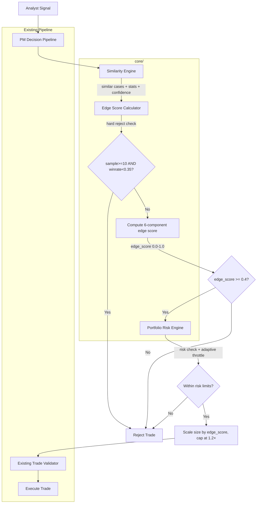

# Design Document: Tier 1 Trading Enhancements (v2)

## Overview

This design covers three new deterministic, LLM-free modules that integrate into the existing Portfolio Manager decision pipeline to upgrade the Paper Trader system from rule-based decisions to adaptive, data-driven execution:

1. **Edge Score Calculator** (`core/edge_score.py`) — Computes a continuous 0.0–1.0 score for each proposed trade using 6 weighted inputs: setup win rate, similarity win rate, signal strength, signal confidence, indicator confluence, and similarity quality (sample-size-aware confidence). Includes a hard rejection rule for proven-bad setups and a position sizing cap. Used to gate trade execution (reject below 0.4) and scale position sizing.

2. **Similarity Matching Engine** (`core/similarity.py`) — Queries the SQLite case library to find historically similar trades using weighted scoring across setup_type, market_regime, RSI distance, VWAP alignment, and EMA trend alignment. Returns top matches ranked by similarity score and computes aggregate performance statistics including a new `similarity_confidence` field. Falls back gracefully when no matches are found (skips similarity weighting instead of penalizing).

3. **Portfolio Risk Engine** (`core/portfolio_risk.py`) — Computes portfolio-level exposure across correlated asset buckets (index ETFs, semiconductors, EVs, mega growth) where symbols can belong to multiple buckets. Validates that new trades don't exceed per-bucket (50%) or configurable total risk thresholds (1.2–1.5×). Includes adaptive risk throttling that reduces position size by 25–50% after 3+ consecutive losses. Outputs a `risk_score` field.

All three modules feed into the PM pipeline sequentially: similarity → edge score → portfolio risk → execute/reject. They are pure Python with no LLM calls, deterministic, and fast enough to run every intraday cycle.

### Key Design Decisions

- **New `core/` package**: The three modules live in a new `core/` directory rather than `utils/` to signal they are core business logic, not utilities. This keeps them cleanly separated from the existing utility layer.
- **Additive integration**: The PM pipeline in `agents/portfolio_manager.py` gains a pre-execution check that calls these modules. Existing validation (`utils/trade_validator.py`) remains untouched — the new checks run *before* the existing validation.
- **DB migration via SQLAlchemy**: New columns (`edge_score`, `similarity_winrate`, `similarity_sample_size`, `similarity_confidence`) are added to the `Trade` model in `db/schema.py`. SQLAlchemy's `create_all` handles schema evolution for SQLite.
- **Weighted similarity matching**: V2 replaces strict all-must-match filtering with weighted scoring so partial matches still surface relevant cases.
- **Sample-size-aware confidence**: The new `similarity_quality` component in the edge score formula prevents overconfidence from small sample sizes.
- **Multi-bucket membership**: Symbols can belong to multiple exposure buckets (e.g., NVDA in both "semis" and "mega_growth").
- **Configurable total exposure**: Total exposure threshold is configurable (1.2–1.5×) rather than fixed at 1.5×.

## Architecture



### Integration Point

The new modules are called inside `execute_trade()` in `agents/portfolio_manager.py`, after the PM's LLM decision but before the existing `validate_trade()` call. The flow is:

1. PM LLM returns decisions (BUY/SHORT/CLOSE)
2. For BUY/SHORT actions:
   a. Query similarity engine for matching cases (weighted scoring)
   b. If sample_size == 0, skip similarity weighting entirely
   c. Hard reject: if case_sample_size >= 10 and setup_winrate < 0.35, reject outright
   d. Compute edge score from signal + case stats + similarity stats (6-component formula)
   e. If edge_score < 0.4 → reject
   f. Scale `quantity` by edge_score, cap at `min(scaled_size, base_size * 1.2)`
   g. Validate portfolio risk (bucket exposure + total risk + adaptive throttling)
   h. If risk exceeded → reject
   i. Proceed to existing `validate_trade()` + `check_correlation()` + `adjust_confidence()`
3. Store edge_score, similarity_winrate, similarity_sample_size, and similarity_confidence on the Trade record
4. Log structured EDGE SCORE, PORTFOLIO RISK, and DECISION blocks

## Components and Interfaces

### 1. Edge Score Calculator (`core/edge_score.py`)

```python
# Default weights (6 components, sum to 1.0)
WEIGHTS = {
    "setup_winrate": 0.25,
    "similarity_winrate": 0.20,
    "signal_strength": 0.15,
    "signal_confidence": 0.10,
    "confluence": 0.15,
    "similarity_quality": 0.15,
}

def compute_edge_score(signal: dict, case_stats: dict, similarity_stats: dict) -> float:
    """
    Compute a 0.0-1.0 edge score for a proposed trade.
    
    Args:
        signal: Analyst signal dict with keys:
            - strength: "weak" | "moderate" | "strong"
            - confidence: "low" | "medium" | "high"
            - setup_type: str
            - indicators: dict with above_vwap, ema_trend, rsi, macd_bias, bb_position
            - bias: "LONG" | "SHORT"
        case_stats: dict with keys:
            - win_rate: float 0.0-1.0
            - sample_size: int
        similarity_stats: dict with keys:
            - similarity_winrate: float 0.0-1.0
            - similarity_avg_r: float
            - sample_size: int
            - similarity_confidence: float 0.0-1.0
    
    Returns:
        float clamped to [0.0, 1.0]
    
    Raises:
        ValueError if hard rejection rule triggers (case_sample_size >= 10 and setup_winrate < 0.35)
    """

def check_hard_rejection(case_stats: dict) -> bool:
    """
    Check if trade should be hard-rejected before computing edge score.
    Returns True if case_sample_size >= 10 and setup_winrate < 0.35.
    """

def similarity_quality(similarity_sample_size: int) -> float:
    """Compute sample-size-aware confidence: min(1.0, similarity_sample_size / 10)."""

def cap_position_size(scaled_size: float, base_size: float) -> float:
    """Cap scaled position size: min(scaled_size, base_size * 1.2)."""

def normalize_winrate(win_rate: float) -> float:
    """Clamp win_rate to [0.0, 1.0]. Identity function since win_rate is already 0-1."""

def map_strength(strength: str) -> float:
    """Map strength string to numeric: strong=1.0, moderate=0.6, weak=0.3, default=0.0."""

def map_confidence(confidence: str) -> float:
    """Map confidence string to numeric: high=1.0, medium=0.6, low=0.3, default=0.0."""

def confluence_score(indicators: dict, bias: str) -> float:
    """
    Count aligned indicators and return 0.0-1.0.
    Checks: above_vwap, ema_trend, rsi range, macd_bias, bb_position.
    Each aligned indicator contributes 1/5 = 0.2 to the score.
    """
```

### 2. Similarity Matching Engine (`core/similarity.py`)

```python
# Default similarity weights
SIMILARITY_WEIGHTS = {
    "setup_match": 0.30,
    "regime_match": 0.25,
    "rsi_distance": 0.15,
    "vwap_alignment": 0.15,
    "trend_alignment": 0.15,
}

def find_similar_cases(signal: dict, engine) -> list[dict]:
    """
    Query case library for historically similar trades using weighted scoring.
    
    Matching criteria (weighted, not all-must-match):
        - setup_type: exact match (highest weight)
        - market_regime: exact match
        - rsi: continuous distance (not ±10 bucket)
        - above_vwap: boolean match
        - ema_trend: alignment match (NEW)
    
    Returns top 10 matches sorted by descending similarity score.
    """

def compute_similarity_score(case: dict, signal: dict) -> float:
    """
    Compute weighted similarity score between a case and the current signal.
    Returns 0.0-1.0 score.
    """

def compute_similarity_stats(cases: list[dict]) -> dict:
    """
    Aggregate performance statistics from matched cases.
    
    Returns:
        {
            "similarity_winrate": float,       # fraction of cases with outcome="success"
            "similarity_avg_r": float,         # average pnl_pct across cases
            "sample_size": int,
            "similarity_confidence": float,    # min(1.0, sample_size / 10) (NEW)
        }
    When sample_size == 0: returns dict with skip_similarity=True flag
    so the edge score computation skips similarity weighting entirely.
    """
```

### 3. Portfolio Risk Engine (`core/portfolio_risk.py`)

```python
BUCKETS = {
    "index": ["SPY", "QQQ", "IWM", "DIA"],
    "semis": ["NVDA", "AMD", "INTC", "TSM"],
    "ev":    ["TSLA", "LCID", "RIVN"],
    "mega_growth": ["NVDA", "TSLA", "META", "AMZN"],  # NEW — symbols can be in multiple buckets
}

MAX_BUCKET_EXPOSURE_PCT = 0.50   # 50% of portfolio per bucket
DEFAULT_MAX_TOTAL_EXPOSURE = 1.5  # configurable 1.2-1.5

def compute_portfolio_risk(
    positions: list[dict], 
    total_equity: float,
    max_total_exposure: float = DEFAULT_MAX_TOTAL_EXPOSURE,
) -> dict:
    """
    Compute current portfolio exposure by bucket.
    
    Args:
        positions: list of dicts with symbol, quantity, avg_cost, side
        total_equity: current total portfolio value
        max_total_exposure: configurable total exposure threshold (1.2-1.5)
    
    Returns:
        {
            "total_exposure": float,
            "bucket_exposure": {
                "index": float,
                "semis": float,
                "ev": float,
                "mega_growth": float,
                "other": float,
            },
            "risk_score": float,  # NEW: composite risk score 0.0-1.0
        }
    """

def validate_portfolio_risk(
    new_trade: dict, 
    positions: list[dict], 
    total_equity: float,
    max_total_exposure: float = DEFAULT_MAX_TOTAL_EXPOSURE,
    recent_losses: int = 0,
) -> tuple[bool, str]:
    """
    Check if adding new_trade would exceed risk limits.
    Also applies adaptive risk throttling.
    
    Args:
        new_trade: dict with symbol, quantity, price
        positions: current open positions
        total_equity: current portfolio value
        max_total_exposure: configurable threshold (1.2-1.5)
        recent_losses: count of consecutive recent losing trades
    
    Returns:
        (True, "OK") if trade is allowed
        (False, "reason") if trade would exceed limits
    """

def adaptive_risk_throttle(base_size: float, recent_losses: int) -> float:
    """
    Reduce position size based on recent loss streak.
    If recent_losses >= 3: reduce by 25-50%.
    Returns adjusted size.
    """

def compute_risk_score(total_exposure: float, bucket_exposure: dict, recent_losses: int) -> float:
    """
    Compute composite risk score 0.0-1.0 summarizing overall portfolio risk.
    Higher = more risk.
    """
```

### 4. PM Pipeline Integration (`agents/portfolio_manager.py`)

Modified `execute_trade()` adds a pre-validation block for BUY/SHORT actions:

```python
# New pre-validation block (before existing validate_trade)
if action in ("BUY", "SHORT"):
    from core.similarity import find_similar_cases, compute_similarity_stats
    from core.edge_score import compute_edge_score, check_hard_rejection, cap_position_size
    from core.portfolio_risk import validate_portfolio_risk, compute_portfolio_risk, adaptive_risk_throttle

    # 1. Similarity lookup (weighted scoring)
    similar = find_similar_cases(signal_for_symbol, engine)
    sim_stats = compute_similarity_stats(similar)

    # 2. Hard rejection check
    case_stats = {"win_rate": ..., "sample_size": ...}
    if check_hard_rejection(case_stats):
        log.warning(f"Hard reject: {symbol} setup winrate {case_stats['win_rate']:.2f} with {case_stats['sample_size']} cases")
        return False, f"Hard reject: setup winrate too low ({case_stats['win_rate']:.2f})"

    # 3. Edge score (6-component formula)
    edge = compute_edge_score(signal_for_symbol, case_stats, sim_stats)
    
    # Log edge score components
    log.info(f"EDGE SCORE: {edge:.2f}\n"
             f"  setup_winrate={case_stats['win_rate']:.2f} (n={case_stats['sample_size']})\n"
             f"  similarity_winrate={sim_stats.get('similarity_winrate', 0):.2f} (n={sim_stats.get('sample_size', 0)})\n"
             f"  similarity_confidence={sim_stats.get('similarity_confidence', 0):.2f}\n"
             f"  confluence=...")
    
    if edge < 0.4:
        log.info(f"DECISION: status=REJECTED reason=edge_score_too_low ({edge:.2f})")
        return False, f"Edge score too low ({edge:.2f})"
    
    # 4. Scale position size with cap
    base_size = decision["quantity"]
    scaled_size = max(1, int(base_size * edge))
    decision["quantity"] = int(cap_position_size(scaled_size, base_size))
    
    # 5. Adaptive risk throttling
    recent_losses = count_recent_losses(db, profile_id)  # count consecutive recent losses
    if recent_losses >= 3:
        decision["quantity"] = int(adaptive_risk_throttle(decision["quantity"], recent_losses))
    
    # 6. Portfolio risk check
    positions = db.query(Position).filter_by(profile=profile_id).all()
    pos_list = [{"symbol": p.symbol, "quantity": p.quantity, "avg_cost": p.avg_cost, "side": p.side} for p in positions]
    risk_result = compute_portfolio_risk(pos_list, total_equity)
    
    log.info(f"PORTFOLIO RISK:\n"
             f"  total_exposure={risk_result['total_exposure']:.2f}\n"
             f"  {', '.join(f'{k}={v:.2f}' for k, v in risk_result['bucket_exposure'].items())}")
    
    risk_ok, risk_msg = validate_portfolio_risk(
        {"symbol": symbol, "quantity": decision["quantity"], "price": price},
        pos_list, total_equity, recent_losses=recent_losses
    )
    if not risk_ok:
        log.info(f"DECISION: status=REJECTED reason={risk_msg}")
        return False, risk_msg
    
    log.info(f"DECISION: size_scaled={decision['quantity']} status=EXECUTED")
```

### 5. Database Schema Changes (`db/schema.py`)

Four columns on the `Trade` model (one new in v2):

```python
edge_score = Column(Float, nullable=True)                # 0.0-1.0
similarity_winrate = Column(Float, nullable=True)        # 0.0-1.0
similarity_sample_size = Column(Integer, nullable=True)  # count of matched cases
similarity_confidence = Column(Float, nullable=True)     # NEW: min(1.0, sample_size/10)
```

## Data Models

### Edge Score Input/Output

```python
# Input: signal dict (from Analyst agent_memory)
signal = {
    "signal": "LONG",
    "strength": "strong",
    "confidence": "high",
    "setup_type": "gap_and_go",
    "indicators": {
        "above_vwap": True,
        "ema_trend": "bullish",
        "rsi": 58.3,
        "macd_bias": "bullish",
        "bb_position": "upper",
    },
    "bias": "LONG",
}

# Input: case_stats (from existing get_win_rate_by_setup or adjust_confidence)
case_stats = {
    "win_rate": 0.65,
    "sample_size": 12,
}

# Input: similarity_stats (from similarity engine)
similarity_stats = {
    "similarity_winrate": 0.60,
    "similarity_avg_r": 1.8,
    "sample_size": 8,
    "similarity_confidence": 0.80,  # NEW: min(1.0, 8/10)
}

# Output
edge_score = 0.64  # float, clamped [0.0, 1.0]
```

### Similarity Match Record

Each matched case from `find_similar_cases` returns the existing Case dict structure (same as `query_cases` in `utils/case_library.py`), ranked by weighted similarity score rather than strict filtering.

### Portfolio Risk State

```python
portfolio_risk = {
    "total_exposure": 0.42,
    "bucket_exposure": {
        "index": 0.17,
        "semis": 0.25,
        "ev": 0.00,
        "mega_growth": 0.15,  # NEW bucket
        "other": 0.00,
    },
    "risk_score": 0.35,  # NEW: composite risk score
}
```

### Trade Record (extended)

The existing `Trade` model gains four nullable columns (one new in v2). Existing trades with `NULL` values are fully backward-compatible — no migration script needed since SQLAlchemy `create_all` adds missing columns for SQLite.

## Correctness Properties

*A property is a characteristic or behavior that should hold true across all valid executions of a system — essentially, a formal statement about what the system should do. Properties serve as the bridge between human-readable specifications and machine-verifiable correctness guarantees.*

### Property 1: Edge score formula correctness (v2)

*For any* valid signal (with strength in {weak, moderate, strong}, confidence in {low, medium, high}, and an indicators dict), any case_stats dict (with win_rate in [0.0, 1.0] and sample_size >= 0), and any similarity_stats dict (with similarity_winrate in [0.0, 1.0] and sample_size >= 0), `compute_edge_score(signal, case_stats, similarity_stats)` SHALL return a value equal to `clamp(0.25 × normalize_winrate(case_stats.win_rate) + 0.20 × normalize_winrate(similarity_stats.similarity_winrate) + 0.15 × map_strength(signal.strength) + 0.10 × map_confidence(signal.confidence) + 0.15 × confluence_score(signal.indicators, signal.bias) + 0.15 × similarity_quality(similarity_stats.sample_size), 0.0, 1.0)`.

**Validates: Requirements 1.1, 1.9, 1.10**

### Property 2: Edge score output range invariant

*For any* input dictionaries (including adversarial inputs with out-of-range win rates, unknown strength/confidence strings, missing keys, or empty indicator dicts), `compute_edge_score` SHALL return a float in the range [0.0, 1.0] inclusive, never raising an unhandled exception (except for hard rejection via ValueError).

**Validates: Requirements 1.2**

### Property 3: Confluence score correctness

*For any* indicators dictionary containing boolean/string values for above_vwap, ema_trend, rsi, macd_bias, and bb_position, and any bias direction (LONG or SHORT), `confluence_score(indicators, bias)` SHALL return a value equal to the count of aligned indicators divided by 5, where alignment is defined as: above_vwap is true, ema_trend matches bias direction, RSI is in favorable range (30–70 for LONG, or inverse for SHORT), MACD bias matches direction, and bb_position is favorable.

**Validates: Requirements 1.7**

### Property 4: Hard rejection rule correctness

*For any* case_stats dict where sample_size >= 10 and win_rate < 0.35, `check_hard_rejection(case_stats)` SHALL return True. *For any* case_stats where sample_size < 10 or win_rate >= 0.35, it SHALL return False.

**Validates: Requirements 1.11**

### Property 5: Position sizing cap invariant

*For any* scaled_size and base_size where both are positive, `cap_position_size(scaled_size, base_size)` SHALL return a value <= `base_size * 1.2`.

**Validates: Requirements 1.12, 4.3**

### Property 6: Similarity confidence computation

*For any* sample_size >= 0, `similarity_confidence` SHALL equal `min(1.0, sample_size / 10)`. When sample_size is 0, similarity_confidence SHALL be 0.0. When sample_size >= 10, similarity_confidence SHALL be 1.0.

**Validates: Requirements 2.3**

### Property 7: Adaptive risk throttling

*For any* base_size > 0 and recent_losses >= 3, `adaptive_risk_throttle(base_size, recent_losses)` SHALL return a value between `base_size * 0.50` and `base_size * 0.75` inclusive.

**Validates: Requirements 3.7**

### Property 8: Multi-bucket exposure accounting

*For any* symbol that appears in multiple BUCKETS entries, `compute_portfolio_risk` SHALL count that symbol's exposure in each bucket it belongs to independently.

**Validates: Requirements 3.1**

## Error Handling

### Edge Score Calculator
- Unknown strength/confidence strings → default to 0.0 (most conservative)
- Missing keys in signal/case_stats/similarity_stats → use 0.0 defaults
- Win rates outside [0.0, 1.0] → clamp to [0.0, 1.0]
- Empty indicators dict → confluence_score returns 0.0
- Non-numeric values → caught and defaulted to 0.0
- Hard rejection (sample_size >= 10, winrate < 0.35) → raise ValueError or return rejection flag

### Similarity Engine
- No matching cases found → return empty list; `compute_similarity_stats` returns dict with `skip_similarity=True` so edge score skips similarity weighting entirely (not penalized with zeros)
- Database connection errors → log error, return empty results (trade proceeds without similarity data)
- Cases with null pnl_pct → excluded from avg_r calculation
- Missing RSI or ema_trend in signal → those criteria get zero weight in similarity scoring

### Portfolio Risk Engine
- Empty positions list → all exposures are 0.0, trade is allowed
- Symbol not in any bucket → classified as "other"
- Zero total_equity → reject trade (division by zero guard)
- Negative quantities → treated as absolute values
- Symbol in multiple buckets → counted in each bucket independently
- recent_losses < 0 → treated as 0

### PM Pipeline Integration
- If any core module raises an unexpected exception → log the error, skip that check, and proceed with existing validation (fail-open for non-critical checks, fail-closed for edge score)
- Edge score computation failure → reject trade (fail-closed, since we can't assess edge)
- Similarity engine failure → proceed with zero similarity stats (fail-open)
- Portfolio risk failure → proceed with existing correlation check only (fail-open)

## Testing Strategy

### Property-Based Tests (using Hypothesis for Python)

Each correctness property maps to a property-based test with minimum 100 iterations:

1. **test_edge_score_formula_v2** — Generate random valid signals, case_stats, similarity_stats. Verify output matches the 6-component weighted formula.
   - Tag: `Feature: tier1-trading-enhancements, Property 1: Edge score formula correctness (v2)`

2. **test_edge_score_range_invariant** — Generate arbitrary inputs including edge cases. Verify 0.0 <= output <= 1.0.
   - Tag: `Feature: tier1-trading-enhancements, Property 2: Edge score output range invariant`

3. **test_confluence_score_correctness** — Generate random indicator dicts and bias. Verify score equals aligned_count / 5.
   - Tag: `Feature: tier1-trading-enhancements, Property 3: Confluence score correctness`

4. **test_hard_rejection_rule** — Generate random case_stats. Verify hard rejection triggers iff sample_size >= 10 and win_rate < 0.35.
   - Tag: `Feature: tier1-trading-enhancements, Property 4: Hard rejection rule correctness`

5. **test_position_sizing_cap** — Generate random scaled_size and base_size. Verify result <= base_size * 1.2.
   - Tag: `Feature: tier1-trading-enhancements, Property 5: Position sizing cap invariant`

6. **test_similarity_confidence** — Generate random sample sizes. Verify similarity_confidence == min(1.0, sample_size / 10).
   - Tag: `Feature: tier1-trading-enhancements, Property 6: Similarity confidence computation`

7. **test_adaptive_risk_throttle** — Generate random base_size and recent_losses >= 3. Verify output in [base_size * 0.50, base_size * 0.75].
   - Tag: `Feature: tier1-trading-enhancements, Property 7: Adaptive risk throttling`

8. **test_multi_bucket_exposure** — Generate positions with symbols in multiple buckets. Verify each bucket counts the symbol independently.
   - Tag: `Feature: tier1-trading-enhancements, Property 8: Multi-bucket exposure accounting`

### Unit Tests (pytest)

- `test_map_strength` — 3 examples: strong→1.0, moderate→0.6, weak→0.3 (Req 1.3)
- `test_map_confidence` — 3 examples: high→1.0, medium→0.6, low→0.3 (Req 1.4)
- `test_normalize_winrate` — boundary examples: 0.0→0.0, 0.5→0.5, 1.0→1.0 (Req 1.5, 1.6)
- `test_similarity_quality` — examples: 0→0.0, 5→0.5, 10→1.0, 20→1.0 (Req 1.10)
- `test_no_llm_calls` — mock LLM functions, verify zero calls during edge score computation (Req 1.8)
- `test_similarity_empty_cases_skip` — verify sample_size==0 returns skip_similarity flag (Req 2.4)
- `test_similarity_weighted_scoring` — verify weighted scoring returns partial matches (Req 2.6)
- `test_similarity_stats_with_confidence` — verify similarity_confidence in output (Req 2.3)
- `test_portfolio_risk_mega_growth_bucket` — verify mega_growth bucket classification (Req 3.1)
- `test_portfolio_risk_multi_bucket` — verify NVDA counted in both semis and mega_growth (Req 3.1)
- `test_portfolio_risk_configurable_threshold` — verify configurable 1.2-1.5 threshold (Req 3.4)
- `test_portfolio_risk_blocks_overexposed` — verify rejection when bucket exceeds 50%
- `test_portfolio_risk_allows_safe_trade` — verify acceptance when within limits
- `test_portfolio_risk_risk_score_output` — verify risk_score in output dict (Req 3.5)
- `test_adaptive_throttle_reduces_size` — verify 25-50% reduction after 3+ losses (Req 3.7)

### Integration Tests

- `test_pm_pipeline_edge_score_rejection` — end-to-end: PM decision with low edge score gets rejected
- `test_pm_pipeline_hard_rejection` — end-to-end: PM decision with proven-bad setup gets hard rejected
- `test_pm_pipeline_size_scaling_with_cap` — verify position quantity is scaled by edge_score and capped at 1.2×
- `test_pm_pipeline_adaptive_throttle` — verify size reduction after loss streak
- `test_trade_record_stores_edge_data` — verify edge_score, similarity_winrate, similarity_sample_size, similarity_confidence are persisted to Trade record
- `test_pm_pipeline_structured_logging` — verify EDGE SCORE, PORTFOLIO RISK, and DECISION log blocks

### Test Configuration

- Property-based tests: `hypothesis` library, `@settings(max_examples=100)`
- Unit tests: `pytest`
- All tests in `tests/` directory mirroring `core/` structure
