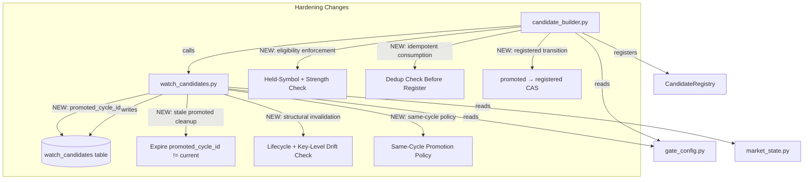
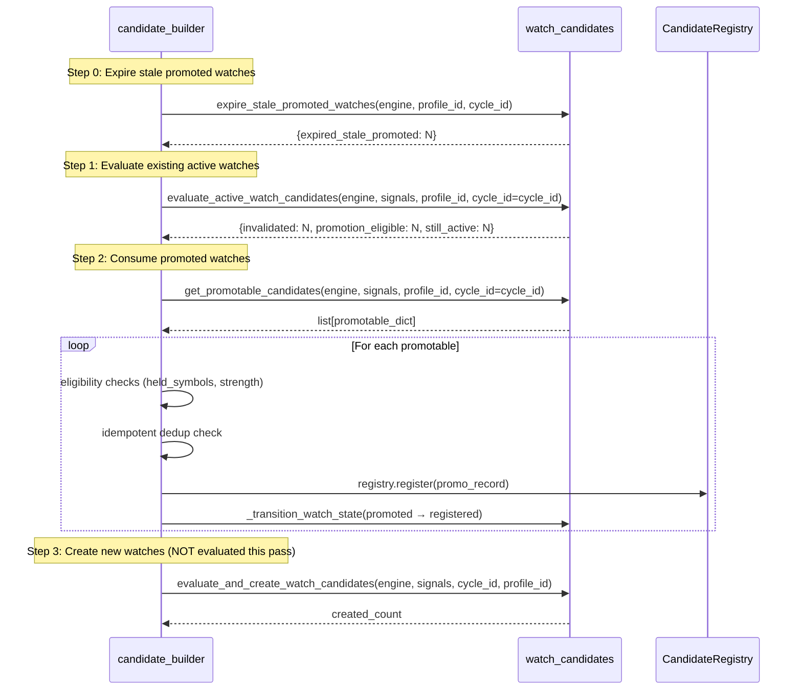
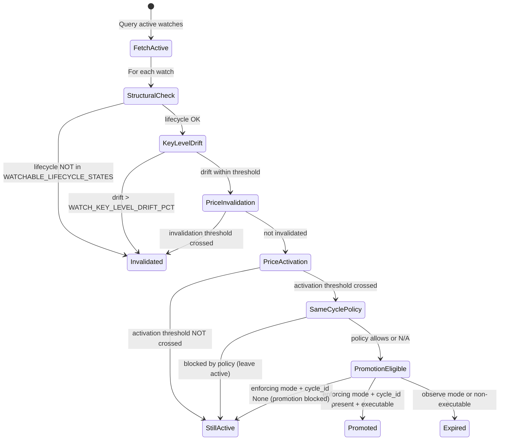

# Design Document: Watch Candidate Hardening

## Overview

This design addresses four logic gaps in the watch candidate lifecycle that must be resolved before enabling `MARKET_STATE_MODE=enforcing` in production:

1. **Promoted-watch re-query duplication** — promoted watches lack cycle scoping and terminal consumption state, causing stale re-queries across cycles.
2. **Promoted-watch eligibility bypass** — promoted watches skip the held-symbol and signal-strength filters that normal PM candidates must pass.
3. **Missing structural invalidation** — active watches promote on price thresholds alone without checking whether the underlying market structure has degraded.
4. **Same-cycle instant-promotion** — watches created and promoted in the same cycle never actually observe a subsequent market state.

All changes are guarded by the existing `MARKET_STATE_MODE` feature flag and follow fail-open (observability) / fail-closed (safety) conventions.

### Non-Goals

- **Short-side market-state parity** (trigger model, VWAP distance) is explicitly not addressed by this hardening patch and is deferred to a follow-up design.
- **Same-cycle activation fast-path** (evaluating newly-created watches in the same pass they are created) is explicitly deferred. In this patch, newly created watches are created in the final step of the cycle and are **not** evaluated that pass — they are first evaluated in the next cycle. The `WATCH_SAME_CYCLE_PROMOTION_POLICY` config is retained as a guard for the residual edge case where a watch's `source_cycle_id` equals the current `cycle_id` (rare/never under the new evaluation order), not as a mechanism to promote freshly-created watches within their creation pass.

## Architecture

The hardening patch modifies two existing modules and one configuration module. No new modules are introduced.



### Mandated Evaluation Order in `candidate_builder.py` (CRITICAL CHANGE)

The current code executes: create → evaluate → promote. This design **reverses** the order and prepends a stale-promoted cleanup step:

```
expire stale promoted watches → evaluate existing active watches → consume promoted watches → create new watches
```

New watches are **NOT** evaluated in the same pass they are created. There is no same-cycle fast-path — freshly created watches are first evaluated in the next cycle. This ensures that:
- Stale promoted watches from a crashed/incomplete prior cycle are decisively expired before evaluation begins (no cross-cycle promotion)
- Watches observe at least one subsequent market state before promotion
- Promoted watches from a prior evaluation are consumed before new ones are created
- The closed set of PM candidates is deterministic within a cycle



### Evaluation Order Within `evaluate_active_watch_candidates()`

The same-cycle promotion policy is applied **after** price activation has been detected — it can only gate a watch that has already crossed its activation threshold. It therefore sits between activation detection and the final promote transition, never before price evaluation.



### Watch Candidate State Machine (Modified)

```mermaid
stateDiagram-v2
    [*] --> active
    active --> promoted: activation threshold crossed (enforcing)
    active --> invalidated: price/structural invalidation
    active --> expired: TTL/observe-mode/replaced
    promoted --> registered: consumed by candidate_builder (idempotent)
    promoted --> expired: eligibility blocked / geometry failed / registry error
    promoted --> expired: promotion_expired_stale_cycle (promoted_cycle_id != current)

    note right of registered: NEW terminal state
    note right of promoted: NEW: records promoted_cycle_id
```

Terminal states: `invalidated`, `expired`, `registered`
Transient states: `active`, `promoted` (must reach terminal before next cycle boundary)

## Components and Interfaces

### 1. Schema Changes (`orchestrator.py`)

A new column `promoted_cycle_id` is added to `watch_candidates` via non-destructive `ALTER TABLE ADD COLUMN`:

```sql
ALTER TABLE watch_candidates ADD COLUMN promoted_cycle_id TEXT;
```

A partial index supports the new cycle-scoped promoted query:

```sql
CREATE INDEX IF NOT EXISTS idx_watch_candidates_promoted_cycle
ON watch_candidates (profile_id, promoted_cycle_id)
WHERE state = 'promoted';
```

The `registered` state does not require a new index — registered watches are never queried.

### 2. Modified `_transition_watch_state()` (`watch_candidates.py`)

The CAS WHERE clause is expanded to accept both `active` and `promoted` as source states. A new optional `promoted_cycle_id` parameter is written atomically with the state change so that a watch transitioning to `promoted` never leaves a NULL or stale `promoted_cycle_id` relative to the state transition:

```python
def _transition_watch_state(
    engine,
    watch_id: str,
    new_state: str,
    outcome_json: str | None = None,
    *,
    expected_state: str = "active",
    promoted_cycle_id: str | None = None,
) -> bool:
    """Transition a watch candidate state via CAS.

    Uses CAS pattern: only transitions if current state matches expected_state.
    Default expected_state is 'active' for backward compatibility.
    For promoted → registered, caller passes expected_state='promoted'.

    When promoted_cycle_id is provided (typically for active → promoted), it is
    written atomically with the state change. COALESCE preserves any existing
    value when the parameter is None, so non-promotion transitions never clear it.
    """
```

**Atomic CAS SQL** (writes `promoted_cycle_id` in the same UPDATE as the state change):

```sql
UPDATE watch_candidates
SET state = :new_state,
    outcome_json = COALESCE(:outcome_json, outcome_json),
    promoted_cycle_id = COALESCE(:promoted_cycle_id, promoted_cycle_id),
    updated_at = :now
WHERE watch_id = :watch_id AND state = :expected_state
```

This guarantees Requirement 1.12: a promoted row is never observable with a NULL/stale `promoted_cycle_id`, because the column is set in the same transaction that flips the state to `promoted`.

### 3. New `expire_stale_promoted_watches()` (`watch_candidates.py`)

Called as the **FIRST** step of the candidate_builder evaluation order (before evaluating any active watch), this dedicated function decisively expires any `promoted` watch left over from a prior cycle that crashed before consumption. Such a watch would otherwise be un-consumable (`get_promotable_candidates()` filters by the current `promoted_cycle_id`) yet still occupy a transient state.

```python
def expire_stale_promoted_watches(
    engine,
    profile_id: str,
    cycle_id: str,
) -> int:
    """Expire promoted watches whose promoted_cycle_id != current cycle_id.

    Runs at cycle start, BEFORE evaluating active watches. Transitions each
    stale promoted row to 'expired' with outcome_json containing
    {"terminal_reason": "promotion_expired_stale_cycle"} via CAS
    (expected_state='promoted').

    This is a decisive expire — NOT a re-consume. A watch that was promoted in
    an earlier cycle but never consumed (e.g., crash before the promotion loop)
    is retired with a clean audit trail rather than promoted across cycles.

    Returns the count of expired stale promoted rows. Fail-open: logs WARNING
    and returns 0 if the column is missing (pre-migration) or a CAS write fails.
    """
```

**Query** (scoped to the profile, matching any promoted row not belonging to the current cycle):

```sql
SELECT watch_id FROM watch_candidates
WHERE profile_id = :profile_id
  AND state = 'promoted'
  AND (promoted_cycle_id IS NULL OR promoted_cycle_id != :cycle_id)
```

Each matched row is transitioned via `_transition_watch_state(..., expected_state='promoted')`. Rows where the CAS fails (already consumed concurrently) are skipped harmlessly.

### 4. Modified `evaluate_active_watch_candidates()` (`watch_candidates.py`)

New signature (backward-compatible):

```python
def evaluate_active_watch_candidates(
    engine,
    signals: dict[str, dict],
    profile_id: str,
    *,
    cycle_id: str | None = None,
) -> dict[str, int]:
```

New evaluation order per watch (same-cycle policy is applied AFTER price activation is detected, gating only the final promote transition):
1. **Structural invalidation** — lifecycle state check, then key-level drift check
2. **Price-threshold invalidation** — existing invalidation logic
3. **Price-threshold activation detection** — existing activation logic
4. **Same-cycle promotion policy** — only if activation was detected AND source_cycle_id == cycle_id
5. **Promote / block transition** — the actual `active → promoted` CAS

When transitioning to `promoted`, records `promoted_cycle_id = cycle_id` on the row (via the `promoted_cycle_id` parameter of `_transition_watch_state()`, written atomically with the state change).

**Enforcing mode cycle_id requirement (blocks promotion)**: When `MARKET_STATE_MODE == "enforcing"` and `cycle_id is None`, the function still runs all invalidation checks (structural + price-threshold) but SHALL NOT transition any watch to `promoted` — promotion is blocked entirely and a WARNING is logged indicating cycle_id is required for promotion in enforcing mode. This prevents leaving a watch in `promoted` state with a NULL `promoted_cycle_id` that `get_promotable_candidates()` could never consume. When mode is NOT enforcing and `cycle_id is None`, skips same-cycle policy entirely and allows promotion as normal (backward-compatible for tests and observe mode).

### 5. Structural Invalidation Algorithm

```python
def _check_structural_invalidation(
    watch: WatchCandidate,
    current_signal: dict,
) -> str | None:
    """Return terminal_reason if structurally invalid, None otherwise.

    Checks (in order):
    1. Lifecycle state regression: current setup_lifecycle_state not in
       WATCHABLE_LIFECYCLE_STATES → 'structural_degradation'
    2. Key-level drift: any stored key level drifted > WATCH_KEY_LEVEL_DRIFT_PCT
       → 'key_level_drift'

    Fail-open: returns None (skip) if signal is missing lifecycle data or
    has no comparable key levels.
    """
```

**Key-level drift computation**:

```python
drift_pct = abs(current_value - stored_value) / stored_value * 100
```

Compared levels: `support` and `resistance` from `key_levels_json` (stored at creation) vs. current signal's `key_levels`. Only levels where **both** stored and current values are numeric and > 0 are compared.

**Drift math skips non-numeric and <= 0 levels**: When a stored or current level value is non-numeric (e.g., None, string) or <= 0, that level is skipped from the drift comparison and logged at DEBUG level with the reason (e.g., "Skipping drift check for support: stored value non-numeric" or "Skipping drift check for resistance: current value <= 0").

**TTL backstop for missing signal data**: When an active watch has no current signal data for its symbol across repeated evaluation cycles, the watch relies on TTL expiration (`expires_at`) as the defined cleanup mechanism. No special-case invalidation is needed — the existing `expire_session_watch_candidates()` sweep handles this.

### 6. Same-Cycle Promotion Policy

This check is invoked **only after** price activation has been detected for a watch. It governs the residual edge case where an already-activated watch's `source_cycle_id` equals the current `cycle_id`. Under the new evaluation order (create new watches last, never evaluated same pass), this is rare or never, but the policy remains as a guard.

```python
def _check_same_cycle_policy(
    watch: WatchCandidate,
    current_signal: dict,
    cycle_id: str | None,
) -> bool:
    """Return True if promotion is BLOCKED by same-cycle policy.

    Returns False (allow) when:
    - cycle_id is None (backward compat — skip policy)
    - source_cycle_id != cycle_id (not same-cycle)
    - policy is 'always'
    - policy is 'activation_pending_only' AND lifecycle == 'activation_pending'

    Returns True (block) when:
    - policy is 'never' AND same-cycle
    - policy is 'activation_pending_only' AND same-cycle AND lifecycle != 'activation_pending'
    """
```

### 7. Modified `get_promotable_candidates()` (`watch_candidates.py`)

New signature (backward-compatible):

```python
def get_promotable_candidates(
    engine,
    signals: dict[str, dict],
    profile_id: str,
    *,
    cycle_id: str | None = None,
) -> list[dict]:
```

**Enforcing mode cycle_id requirement**: When `MARKET_STATE_MODE == "enforcing"` and `cycle_id is None`, returns an empty list and logs a WARNING: "get_promotable_candidates called without cycle_id in enforcing mode — returning empty". This prevents un-scoped queries from polluting the candidate pipeline.

**Non-enforcing mode fallback**: When `MARKET_STATE_MODE` is NOT `"enforcing"` and `cycle_id is None`, falls back to existing behavior (all promoted for profile) — backward-compatible for tests and observe mode.

Query filter updated to include `promoted_cycle_id = :cycle_id` when cycle_id is provided.

### 8. Modified Candidate Builder Integration (`candidate_builder.py`)

The watch candidate management block in `build_candidate_set()` is restructured to enforce the mandated evaluation order:

```python
# ---------------------------------------------------------------------------
# Watch Candidate Management (EVALUATION ORDER IS CRITICAL)
# Mandated order: expire stale promoted → evaluate → consume → create
# ---------------------------------------------------------------------------
from utils.gate_config import MARKET_STATE_MODE
if MARKET_STATE_MODE != "disabled":
    try:
        from utils.watch_candidates import (
            evaluate_and_create_watch_candidates,
            evaluate_active_watch_candidates,
            expire_stale_promoted_watches,
            get_promotable_candidates,
            _transition_watch_state,
        )

        # Step 0: Expire stale promoted watches from prior cycles FIRST
        if cycle_id is not None:
            expire_stale_promoted_watches(
                engine=db,
                profile_id=profile_id,
                cycle_id=cycle_id,
            )

        # Step 1: Evaluate existing active watches
        evaluate_active_watch_candidates(
            engine=db,
            signals=signals,
            profile_id=profile_id,
            cycle_id=cycle_id,
        )

        # Step 2: Consume promoted watches (enforcing mode only)
        if MARKET_STATE_MODE == "enforcing":
            promotable = get_promotable_candidates(
                engine=db,
                signals=signals,
                profile_id=profile_id,
                cycle_id=cycle_id,
            )
            for promo in promotable:
                _process_promoted_watch(
                    db, promo, registry, held_symbols,
                    min_signal_strength, profile_id, cycle_id,
                    cycle_expires_at,
                )

        # Step 3: Create new watches LAST (NOT evaluated this pass)
        evaluate_and_create_watch_candidates(
            engine=db,
            signals=signals,
            cycle_id=cycle_id,
            profile_id=profile_id,
        )
    except Exception as wc_exc:
        logger.warning("Watch candidate management failed: %s", wc_exc)
```

### 9. Promotion Loop with Idempotent Consumption (`candidate_builder.py`)

The promotion processing is extracted into a helper with full eligibility checks, idempotent dedup, and terminal failure states:

```python
def _process_promoted_watch(
    engine, promo: dict, registry: CandidateRegistry,
    held_symbols: set[str], min_signal_strength: str,
    profile_id: str, cycle_id: str, cycle_expires_at: datetime | None,
) -> None:
    """Process a single promoted watch through eligibility → geometry → register.

    Eligibility checks (short-circuit on first failure):
    1. held_symbols exclusion → promotion_blocked_held_symbol
    2. min_signal_strength threshold → promotion_blocked_weak_signal

    Idempotent consumption:
    - Before registry.register(), check if PM candidate already exists for
      (source_signal_id=watch_id, profile_id, cycle_id).
    - If exists: skip registration, transition to registered, log DEBUG.

    Terminal failure states in promotion loop:
    - promotion_blocked_held_symbol
    - promotion_blocked_weak_signal
    - promotion_blocked_eligibility_error (exception during checks)
    - promotion_blocked_geometry_failed (scaffold status != 'ok' or exception)
    - promotion_blocked_no_geometry_candidates (scaffold ok, empty candidates)
    - promotion_blocked_registry_error (registry.register() raises)
    """
```

**Idempotent promotion consumption**: Before calling `registry.register()`, query `pm_candidates` for an existing record with `source_signal_id = watch_id AND profile_id = :profile_id AND cycle_id = :cycle_id`. If found, skip registration, transition the watch to `registered`, and log at DEBUG level. This prevents duplicate PM candidates when the promotion loop is retried (e.g., crash recovery).

**Terminal failure reasons in promotion loop**:

| Failure | terminal_reason | Transition |
|---------|----------------|------------|
| Symbol in held_symbols | `promotion_blocked_held_symbol` | promoted → expired |
| Signal strength below threshold | `promotion_blocked_weak_signal` | promoted → expired |
| Exception during eligibility checks | `promotion_blocked_eligibility_error` | promoted → expired |
| Geometry scaffold fails or raises | `promotion_blocked_geometry_failed` | promoted → expired |
| Geometry scaffold ok but 0 candidates | `promotion_blocked_no_geometry_candidates` | promoted → expired |
| registry.register() raises | `promotion_blocked_registry_error` | promoted → expired |
| PM candidate already exists (dedup) | _(none — success path)_ | promoted → registered |
| PM candidate created successfully | _(none — success path)_ | promoted → registered |

### 10. Configuration Constants (`gate_config.py`)

```python
# ---------------------------------------------------------------------------
# Watch Candidate Hardening Constants
# ---------------------------------------------------------------------------

# Key-level drift threshold (percentage). Active watches with support/resistance
# drift exceeding this value are structurally invalidated.
# Default: 2.0% (tighter than a naive 5% — catches meaningful structural shifts
# on intraday key levels where 2% already represents a broken level).
WATCH_KEY_LEVEL_DRIFT_PCT: float = float(
    os.environ.get("WATCH_KEY_LEVEL_DRIFT_PCT", "2.0")
)

# Same-cycle promotion policy.
# Values: "never" | "activation_pending_only" | "always"
_raw_same_cycle_policy = os.environ.get(
    "WATCH_SAME_CYCLE_PROMOTION_POLICY", "activation_pending_only"
)
if _raw_same_cycle_policy not in ("never", "activation_pending_only", "always"):
    logger.warning(
        "Unrecognized WATCH_SAME_CYCLE_PROMOTION_POLICY=%r, defaulting to 'activation_pending_only'",
        _raw_same_cycle_policy,
    )
    _raw_same_cycle_policy = "activation_pending_only"
WATCH_SAME_CYCLE_PROMOTION_POLICY: str = _raw_same_cycle_policy
```

### 11. Modified `expire_session_watch_candidates()` (`watch_candidates.py`)

The existing TTL sweep is broadened so that terminal-state guarantees do not rely solely on the happy-path consumption of promoted watches. Both stale `active` rows AND stale `promoted` rows whose `expires_at` is earlier than the current time are expired in the sweep:

```python
def expire_session_watch_candidates(engine, profile_id: str) -> int:
    """Expire watch candidates past their TTL.

    Sweeps BOTH stale 'active' and stale 'promoted' rows whose expires_at is
    earlier than now, transitioning them to 'expired'. Previously only 'active'
    rows were swept; including 'promoted' guarantees a promoted watch that was
    never consumed (crash between promotion and the promotion loop) still reaches
    a terminal state via TTL rather than lingering as transient.
    """
```

**Updated sweep SQL** (state predicate widened from `state = 'active'` to both transient states):

```sql
UPDATE watch_candidates
SET state = 'expired',
    outcome_json = COALESCE(outcome_json, '{"terminal_reason": "ttl_expired"}'),
    updated_at = :now
WHERE profile_id = :profile_id
  AND state IN ('active', 'promoted')
  AND expires_at < :now
```

Note: `expire_stale_promoted_watches()` (section 3) handles cross-cycle promoted rows within a live cycle; this TTL sweep is the time-based backstop for any transient row (active or promoted) that outlives its `expires_at`.

## Data Models

### Schema: `watch_candidates` Table (Modified)

| Column | Type | Notes |
|--------|------|-------|
| ... (existing columns) | ... | Unchanged |
| `promoted_cycle_id` | TEXT, nullable | NEW — Set when state transitions to `promoted`. Contains the cycle_id in which promotion occurred. NULL for watches that haven't been promoted. |

### State Enumeration (Extended)

| State | Terminal? | Transitions From | Notes |
|-------|-----------|-----------------|-------|
| `active` | No | (initial) | Created by `evaluate_and_create_watch_candidates()` |
| `promoted` | No | `active` | Activation threshold crossed in enforcing mode |
| `registered` | **Yes** (NEW) | `promoted` | Consumed by candidate_builder → PM candidate created or dedup matched |
| `invalidated` | Yes | `active` | Price-threshold or structural invalidation |
| `expired` | Yes | `active`, `promoted` | TTL (active or promoted past `expires_at`), observe-mode, eligibility blocked, geometry failed, registry error, replaced, `promotion_expired_stale_cycle` (promoted row from a prior cycle) |

### Evaluation Check Order (Within `evaluate_active_watch_candidates`)

| Priority | Check | Fail Behavior | Outcome |
|----------|-------|---------------|---------|
| 1 | Structural: lifecycle state | Fail-open (skip if missing) | `invalidated` with `structural_degradation` |
| 2 | Structural: key-level drift | Fail-open (skip non-numeric/≤0 levels) | `invalidated` with `key_level_drift` |
| 3 | Price-threshold invalidation | Existing behavior | `invalidated` with `invalidation_threshold_crossed` |
| 4 | Price-threshold activation detection | Existing behavior | eligible for promotion, or leave `active` if not crossed |
| 5 | Same-cycle promotion policy (only if activation detected) | Fail-open (skip if exception) | Leave `active` (blocked) |
| 6 | Promote/block transition | Blocked if enforcing + cycle_id None | `promoted` (records `promoted_cycle_id`) or `expired` (observe/non-executable) or leave `active` (enforcing + cycle_id None) |

### Eligibility Check Order (Promotion Loop in `candidate_builder`)

| Priority | Check | Fail Behavior | Outcome |
|----------|-------|---------------|---------|
| 1 | Held-symbol exclusion | Fail-closed (block) | `expired` with `promotion_blocked_held_symbol` |
| 2 | Signal strength threshold | Fail-closed (block) | `expired` with `promotion_blocked_weak_signal` |
| 3 | Exception during checks | Fail-closed (block) | `expired` with `promotion_blocked_eligibility_error` |
| 4 | Idempotent dedup check | Skip registration | `registered` (success path) |
| 5 | Geometry scaffold failure | Fail-closed (block) | `expired` with `promotion_blocked_geometry_failed` |
| 6 | Geometry zero candidates | Fail-closed (block) | `expired` with `promotion_blocked_no_geometry_candidates` |
| 7 | Registry error | Fail-closed (block) | `expired` with `promotion_blocked_registry_error` |

### Candidate Builder Evaluation Order (Top-Level)

| Step | Operation | Rationale |
|------|-----------|-----------|
| 0 | `expire_stale_promoted_watches()` | Decisively expire promoted rows from prior cycles (`promoted_cycle_id != cycle_id`) before evaluation — prevents cross-cycle promotion of a watch that crashed before consumption |
| 1 | `evaluate_active_watch_candidates()` | Evaluate existing watches against current signal data |
| 2 | `get_promotable_candidates()` + promotion loop | Consume watches that became promoted in step 1 (scoped to the current cycle) |
| 3 | `evaluate_and_create_watch_candidates()` | Create new watches from current signals LAST — NOT evaluated this pass (no same-cycle fast-path); first evaluated next cycle |

## Correctness Properties

*A property is a characteristic or behavior that should hold true across all valid executions of a system — essentially, a formal statement about what the system should do. Properties serve as the bridge between human-readable specifications and machine-verifiable correctness guarantees.*

### Property 1: Promoted-cycle scoping excludes cross-cycle watches

*For any* set of watch candidates in `promoted` state with varying `promoted_cycle_id` values, calling `get_promotable_candidates()` with a specific `cycle_id` SHALL return only those candidates whose `promoted_cycle_id` matches the provided `cycle_id`.

**Validates: Requirements 1.1, 1.6**

### Property 2: Registered state is query-invisible

*For any* watch candidate in `registered` state, no call to `get_promotable_candidates()` or query for `state = 'active'` or `state = 'promoted'` SHALL ever include that candidate in its results.

**Validates: Requirements 1.4**

### Property 3: Successful promotion produces registered terminal state

*For any* promoted watch candidate that successfully completes PM candidate creation (no exception raised during geometry scaffold and registry.register), the watch SHALL transition to `registered` state.

**Validates: Requirements 1.2**

### Property 4: Idempotent promotion consumption

*For any* promoted watch candidate where a PM candidate already exists for the combination of `source_signal_id = watch_id`, `profile_id`, and `cycle_id`, the Candidate_Builder SHALL skip registration, transition the watch to `registered` state, and NOT create a duplicate PM candidate.

**Validates: Requirements 1.7**

### Property 5: Enforcing mode requires cycle_id for get_promotable_candidates

*For any* call to `get_promotable_candidates()` where `MARKET_STATE_MODE` is `"enforcing"` and `cycle_id` is `None`, the function SHALL return an empty list regardless of how many promoted candidates exist for the profile.

**Validates: Requirements 1.8**

### Property 6: Held-symbol exclusion blocks promotion with short-circuit

*For any* promotable watch candidate whose symbol appears in the current `held_symbols` set, the Candidate_Builder SHALL NOT create a PM candidate, SHALL transition the watch to `expired` state with `terminal_reason` equal to `"promotion_blocked_held_symbol"`, and SHALL NOT evaluate the signal strength check (short-circuit on first failure).

**Validates: Requirements 2.1, 2.3, 2.4**

### Property 7: Signal strength threshold blocks weak promotions

*For any* promotable watch candidate whose current signal strength is below the profile's `min_signal_strength` threshold (per `STRENGTH_ORDER` comparison) AND whose symbol is NOT in `held_symbols`, the Candidate_Builder SHALL NOT create a PM candidate and SHALL transition the watch to `expired` state with `terminal_reason` equal to `"promotion_blocked_weak_signal"`.

**Validates: Requirements 2.2, 2.5**

### Property 8: Promotion loop terminal failures produce correct terminal reasons

*For any* promoted watch candidate that passes eligibility checks but fails during geometry scaffold (exception or non-ok status), produces zero geometry candidates, or encounters a registry error during PM candidate registration, the Candidate_Builder SHALL transition the watch to `expired` state with the appropriate `terminal_reason` (`promotion_blocked_geometry_failed`, `promotion_blocked_no_geometry_candidates`, or `promotion_blocked_registry_error` respectively).

**Validates: Requirements 2.8, 2.9, 2.10**

### Property 9: Structural degradation invalidates active watches

*For any* active watch candidate whose current signal's `setup_lifecycle_state` is NOT in `WATCHABLE_LIFECYCLE_STATES`, the Watch_Candidate_Manager SHALL invalidate the watch with `terminal_reason` equal to `"structural_degradation"`, regardless of price-threshold conditions.

**Validates: Requirements 3.1, 3.2, 3.5**

### Property 10: Key-level drift invalidates active watches

*For any* active watch candidate where at least one stored key level (support or resistance) has a numeric value > 0, and the corresponding current key level is also numeric and > 0, and the drift (`abs(current - stored) / stored * 100`) exceeds `WATCH_KEY_LEVEL_DRIFT_PCT`, the Watch_Candidate_Manager SHALL invalidate the watch with `terminal_reason` equal to `"key_level_drift"`.

**Validates: Requirements 3.3, 3.4**

### Property 11: Drift computation skips non-numeric and non-positive levels

*For any* active watch candidate where a stored or current key level value is non-numeric (None, string, etc.) or less than or equal to zero, that level SHALL be excluded from the drift comparison and SHALL NOT cause invalidation regardless of other level values.

**Validates: Requirements 3.8**

### Property 12: Same-cycle "never" policy blocks all same-cycle promotions

*For any* active watch candidate where `source_cycle_id` equals the current `cycle_id` while `WATCH_SAME_CYCLE_PROMOTION_POLICY` is `"never"`, the Watch_Candidate_Manager SHALL NOT promote the watch and SHALL leave it in `active` state.

**Validates: Requirements 4.4, 4.7**

### Property 13: Same-cycle "activation_pending_only" policy is lifecycle-gated

*For any* active watch candidate where `source_cycle_id` equals the current `cycle_id` while `WATCH_SAME_CYCLE_PROMOTION_POLICY` is `"activation_pending_only"`, promotion SHALL be allowed if and only if the current signal's `setup_lifecycle_state` is `"activation_pending"`. When blocked, the watch SHALL remain in `active` state.

**Validates: Requirements 4.5, 4.7, 4.12**

### Property 14: Evaluation order — structural precedes price, same-cycle policy gates only after activation

*For any* active watch candidate, the evaluation SHALL proceed in the order: structural invalidation → price-threshold invalidation → price-threshold activation detection → same-cycle promotion policy → promote/block. Consequently: (a) if structural invalidation would fire, the watch SHALL be invalidated with the structural reason and no price-threshold or promotion logic SHALL execute; and (b) the same-cycle promotion policy SHALL be evaluated only for a watch whose price activation threshold has already been detected as crossed, gating solely the final `active → promoted` transition and never suppressing invalidation.

**Validates: Requirements 3.5, 4.13**

### Property 15: Disabled mode executes no hardening logic

*For any* watch candidate while `MARKET_STATE_MODE` is `"disabled"`, no structural invalidation, same-cycle policy evaluation, or eligibility enforcement SHALL execute, and the watch state SHALL remain unchanged by hardening code paths.

**Validates: Requirements 5.1**

### Property 16: Hardening exceptions are fail-open (evaluation)

*For any* exception raised during structural invalidation or same-cycle policy checks, the affected watch SHALL remain in its current state (unchanged), and evaluation of remaining watches SHALL continue normally.

**Validates: Requirements 5.4**

### Property 17: Eligibility exceptions are fail-closed (promotion)

*For any* exception raised during eligibility checks (held-symbol or signal-strength) in the promotion loop, the watch SHALL transition to `expired` state with `terminal_reason` equal to `"promotion_blocked_eligibility_error"`, and no PM candidate SHALL be created.

**Validates: Requirements 5.5**

### Property 18: Stale promoted watches are expired at cycle start

*For any* watch candidate in `promoted` state whose `promoted_cycle_id` does not equal the current `cycle_id` (including NULL), calling `expire_stale_promoted_watches()` at cycle start SHALL transition it to `expired` with `terminal_reason` equal to `"promotion_expired_stale_cycle"`, and it SHALL NOT be consumed or promoted into the current cycle's candidate set.

**Validates: Requirements 1.11**

### Property 19: Enforcing mode with cycle_id=None blocks all promotion

*For any* set of active watch candidates evaluated while `MARKET_STATE_MODE` is `"enforcing"` and `cycle_id` is `None`, `evaluate_active_watch_candidates()` SHALL still perform invalidation checks (structural and price-threshold) but SHALL NOT transition any watch to `promoted` state, so no watch is ever left in `promoted` state with a NULL `promoted_cycle_id`.

**Validates: Requirements 4.10**

### Property 20: TTL sweep expires stale promoted rows

*For any* watch candidate in `active` OR `promoted` state whose `expires_at` is earlier than the current time, `expire_session_watch_candidates()` SHALL transition it to `expired` state.

**Validates: Requirements 1.13**

## Error Handling

| Scenario | Strategy | Rationale |
|----------|----------|-----------|
| Structural invalidation check raises exception | Fail-open: log WARNING, skip structural checks, continue to price-threshold | Hardening is observability; blocking evaluation would be worse than missing a structural check |
| Same-cycle policy check raises exception | Fail-open: log WARNING, allow promotion to proceed | Policy is conservative guidance, not safety-critical |
| Eligibility check raises exception | Fail-closed: block promotion, expire watch with `promotion_blocked_eligibility_error` | Eligibility is safety-critical; allowing unchecked could duplicate positions or bypass signal quality |
| Geometry scaffold raises exception | Fail-closed: block promotion, expire watch with `promotion_blocked_geometry_failed` | Geometry is safety-critical — invalid entry/stop/target geometry must never reach PM candidates |
| Geometry scaffold returns 0 candidates | Fail-closed: block promotion, expire watch with `promotion_blocked_no_geometry_candidates` | No valid geometry means no valid trade setup |
| Registry.register() raises exception | Fail-closed: block promotion, expire watch with `promotion_blocked_registry_error`, log WARNING | Registry failure means PM candidate wasn't persisted — watch should not be left as promoted |
| CAS `promoted → registered` fails (rowcount == 0) | Fail-open: log WARNING, continue | PM candidate is already created. The row keeps its prior `promoted_cycle_id`, so next cycle it is decisively expired by `expire_stale_promoted_watches()` (reason `promotion_expired_stale_cycle`) rather than re-consumed; even in the unlikely same-cycle retry, the idempotent dedup check prevents a duplicate PM candidate. Correct in both paths. |
| CAS expiration of blocked promotion fails | Fail-open: log WARNING, continue processing remaining promotables | The watch remains in `promoted` state; next cycle's consumption loop will re-attempt or TTL-expire |
| `promoted_cycle_id` column missing (pre-migration) | Fail-open: catch OperationalError on the column write, log WARNING, continue with legacy behavior | Supports rolling deploys where orchestrator hasn't restarted yet |
| Signal missing for watched symbol during evaluation | Fail-open: skip structural checks, increment `still_active` count, rely on TTL backstop | Matches existing behavior; TTL expiration is the defined cleanup |
| `get_promotable_candidates()` called with cycle_id=None in enforcing mode | Return empty list + log WARNING | Prevents un-scoped queries from polluting pipeline in enforcing mode |
| Idempotent dedup: PM candidate already exists | Skip registration, transition to registered, log DEBUG | Crash recovery / retry safety — no duplicate PM candidates created |
| Stale promoted cleanup (`promoted_cycle_id != cycle_id`) at cycle start | Decisive expire to `expired` with `promotion_expired_stale_cycle`; CAS failure per-row logged WARNING and skipped | A promoted row from a crashed prior cycle is un-consumable (cycle-scoped query never returns it); expiring it keeps a clean audit trail and prevents cross-cycle promotion. Column-missing (pre-migration) is caught and returns 0 (fail-open). |
| `expire_stale_promoted_watches()` column missing (pre-migration) | Fail-open: catch OperationalError, log WARNING, return 0 | Supports rolling deploys before the `promoted_cycle_id` migration has applied |
| `evaluate_active_watch_candidates()` called with cycle_id=None in enforcing mode | Run invalidation checks but block all promotion (never transition to `promoted`) + log WARNING | Prevents leaving a watch in `promoted` state with NULL `promoted_cycle_id` that could never be consumed |
| TTL sweep includes stale `promoted` rows (`expires_at < now`) | Transition to `expired` | Terminal-state guarantee for a promoted watch that was never consumed does not rely solely on happy-path consumption |

## Testing Strategy

### Property-Based Tests (Hypothesis)

The feature is well-suited for property-based testing because:
- The state machine has clear universal invariants (terminal states never appear in active queries)
- Eligibility filtering is a pure function of inputs (held_symbols, strength, thresholds)
- Drift computation is a pure numeric function with clear skip conditions
- Policy evaluation is deterministic given (cycle_id, source_cycle_id, lifecycle_state, policy)
- The promotion loop has deterministic terminal failure mappings
- Idempotent consumption is a data-driven decision (exists or not)

**Library**: Hypothesis (already used in the project)
**Minimum iterations**: 100 per property test
**Tag format**: `# Feature: watch-candidate-hardening, Property {N}: {title}`

Each correctness property (1–20) maps to a single property-based test in `tests/test_prop_watch_hardening.py`.

**Generator strategy**: Custom Hypothesis strategies for:
- `WatchCandidate` instances with randomized states, cycle_ids, key_levels (including non-numeric and ≤ 0 edge cases)
- Signal dicts with randomized lifecycle states, key levels, strength values
- `held_symbols` sets with randomized overlap against watch symbols
- `promoted_cycle_id` values for cross-cycle scoping tests
- Policy values from the allowed set `{"never", "activation_pending_only", "always"}`

### Unit Tests (pytest)

Example-based tests for:
- CAS `promoted → registered` transition succeeds
- CAS failure (rowcount == 0) is logged at WARNING and doesn't block
- Eligibility short-circuit ordering verification (held_symbols before strength)
- Same-cycle policy DEBUG logging content
- Backward compatibility: calling modified functions without new params (cycle_id=None)
- Schema migration: `ALTER TABLE ADD COLUMN` is idempotent
- `WATCH_KEY_LEVEL_DRIFT_PCT` default is 2.0
- `WATCH_SAME_CYCLE_PROMOTION_POLICY` defaults to "activation_pending_only" for unrecognized values
- Evaluation order: verify step 1/2/3 execute in correct sequence
- Idempotent dedup: verify no duplicate PM candidate when one already exists
- Geometry failure scenarios produce correct terminal reasons
- Registry error scenarios produce correct terminal reasons
- Stale promoted cleanup: promoted row with `promoted_cycle_id != cycle_id` (and NULL) is expired with `promotion_expired_stale_cycle` at cycle start
- Enforcing mode + cycle_id=None: `evaluate_active_watch_candidates()` runs invalidation but transitions nothing to `promoted` (WARNING logged)
- `_transition_watch_state()` writes `promoted_cycle_id` atomically on active → promoted; COALESCE preserves existing value on non-promotion transitions
- TTL sweep: `expire_session_watch_candidates()` expires both stale `active` and stale `promoted` rows past `expires_at`
- Evaluation order: verify step 0 (expire stale promoted) runs before step 1 (evaluate active)

### Integration Tests

- Full cycle test: create watch → evaluate (structural OK) → evaluate (activation crossed) → promote → build PM candidate → verify registered state
- Evaluation order test: verify that the candidate_builder calls evaluate → consume → create in that order (mock-based ordering verification)
- Observe-mode test: same flow but verify no PM candidate created and watch expires
- Disabled-mode test: verify no hardening logic executes
- Idempotent promotion test: insert PM candidate manually, then run promotion loop — verify no duplicate and watch transitions to registered
- Stale-cycle crash recovery: promote a watch in cycle A, skip consumption, start cycle B — verify the watch is expired with `promotion_expired_stale_cycle` and never enters cycle B's candidate set
- Full evaluation-order test: verify step 0 → 1 → 2 → 3 sequence (expire stale promoted → evaluate → consume → create) via mock-based ordering verification

### Regression Safety

All new configuration constants have safe defaults:
- `WATCH_KEY_LEVEL_DRIFT_PCT` = 2.0 (tight enough to catch meaningful structural shifts on intraday levels)
- `WATCH_SAME_CYCLE_PROMOTION_POLICY` = "activation_pending_only" (most common case allowed)
- `MARKET_STATE_MODE` defaults to "disabled" (no change in behavior)
- New parameters have `None` defaults (opt-in)

Existing tests must continue passing without modification when defaults are applied.
